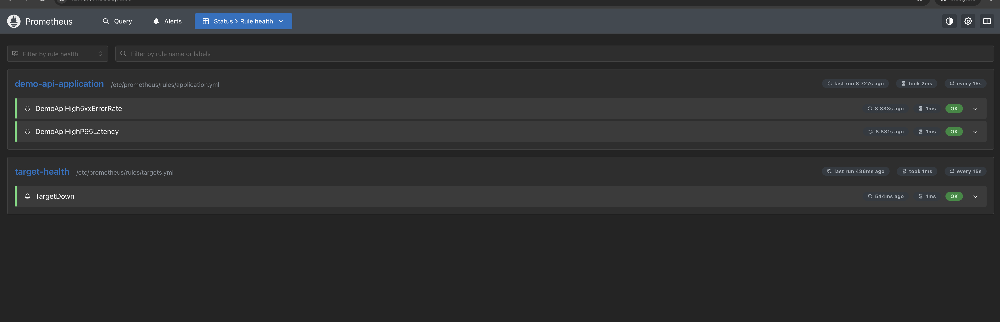
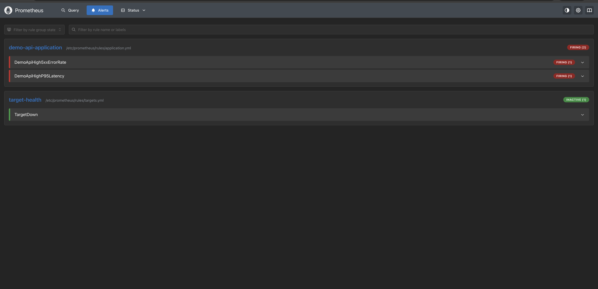
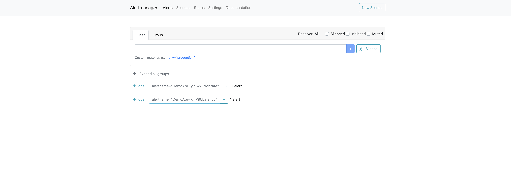
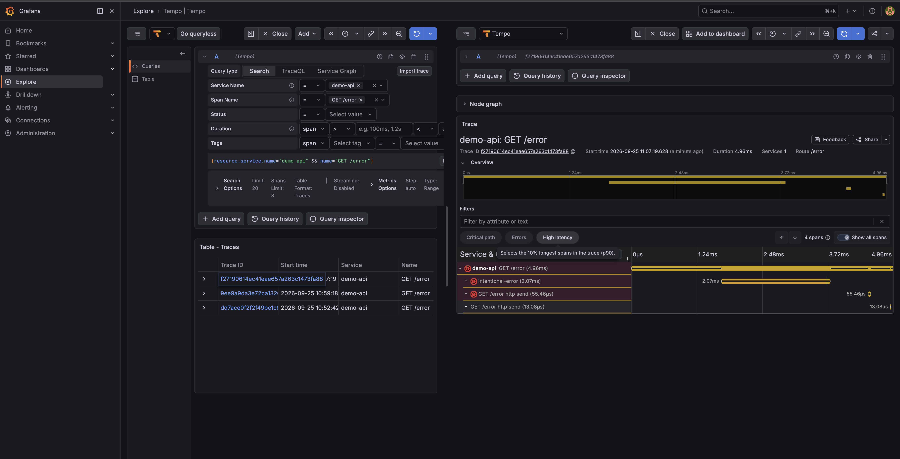
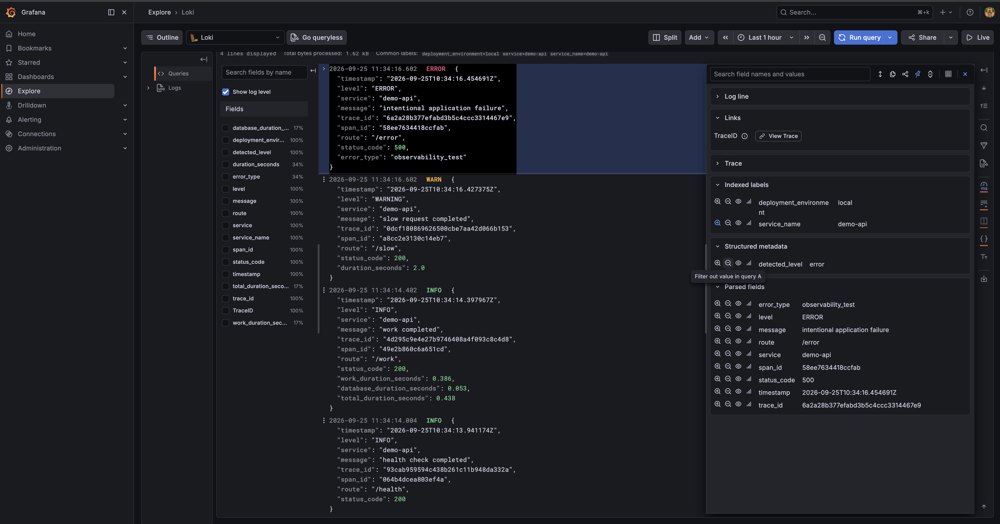
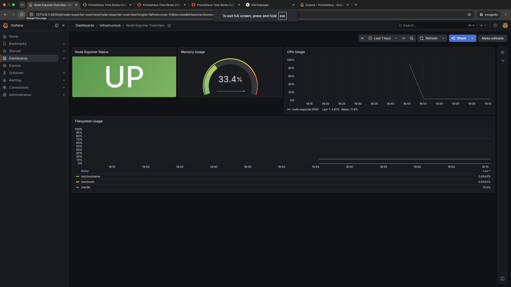
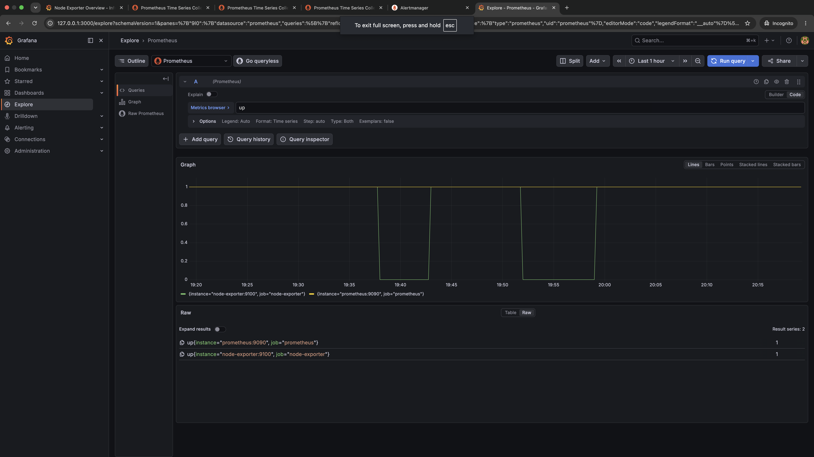
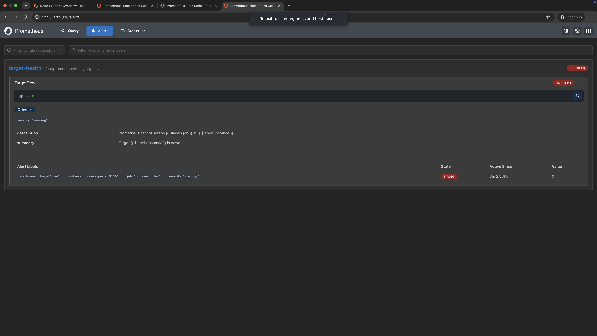
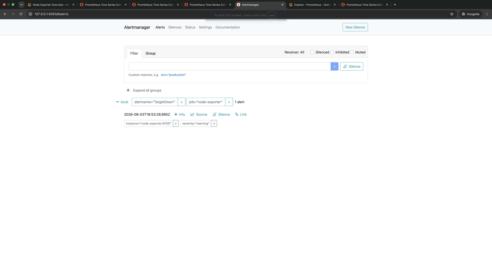

# Platform Engineering Observability

A reproducible local observability platform built with **OpenTelemetry, Prometheus, Grafana, Loki, Tempo, Node Exporter, Alertmanager, FastAPI, Docker, and Docker Compose**.

The project demonstrates practical observability across the three core telemetry signals:

```text
Metrics
Logs
Traces
```

It also demonstrates:

- application-level RED monitoring
- structured logging
- distributed tracing
- log-to-trace correlation
- infrastructure monitoring
- alert evaluation and routing
- deliberate latency and failure testing
- reproducible monitoring configuration

---

# Project Overview

The platform combines application and infrastructure observability in one local environment.

```text
                    ┌─────────────────┐
                    │    FastAPI      │
                    │    demo-api     │
                    └────────┬────────┘
                             │
             ┌───────────────┼────────────────┐
             │               │                │
             │               │                │
          Metrics           Logs            Traces
             │               │                │
             v               v                v
        Prometheus     OTel Collector    OTel Collector
             │               │                │
             │               v                v
             │              Loki             Tempo
             │               │                │
             └───────────────┼────────────────┘
                             v
                           Grafana

Node Exporter
     │
     v
Prometheus
     │
     v
Grafana

Prometheus Alerts
     │
     v
Alertmanager
```

The repository currently demonstrates:

- FastAPI application instrumentation
- Prometheus application metrics
- RED application monitoring
- request-rate monitoring
- HTTP error-rate monitoring
- P50, P95, and P99 latency
- route-level request analysis
- route-level latency analysis
- Node Exporter infrastructure metrics
- OpenTelemetry distributed tracing
- custom application spans
- OpenTelemetry Collector
- Grafana Tempo
- structured JSON application logs
- Grafana Loki
- log-to-trace correlation
- Grafana dashboard provisioning
- Prometheus alert rules
- Alertmanager routing
- deliberate failure and recovery testing
- reproducible Docker Compose deployment

---

# Architecture


---

# Observability Model

The project now covers four operational areas:

```text
Metrics
  +
Logs
  +
Traces
  +
Alerting
```

These answer different questions.

## Metrics

```text
What is happening?
How often?
How slow?
How many failures?
```

## Logs

```text
What event occurred?
What fields were recorded?
What error was produced?
```

## Traces

```text
Where did the request spend time?
Which internal operation was involved?
Which trace belongs to this log?
```

## Alerts

```text
When should an operator be notified?
```

---

# RED Application Monitoring

The application dashboard follows the RED method:

```text
R = Rate
E = Errors
D = Duration
```

This focuses application monitoring on three important questions:

```text
How much traffic is the application receiving?

How many requests are failing?

How long are requests taking?
```

---

# Demo API RED Dashboard

Grafana automatically provisions the:

```text
Demo API RED Dashboard
```

from:

```text
grafana/dashboards/demo-api-red.json
```

The dashboard includes:

- Request Rate
- HTTP 5xx Error Rate
- P50 Latency
- P95 Latency
- P99 Latency
- Request Rate by Route
- Request Rate by Status Code
- Average Latency by Route
- Error Rate by Route


A deliberate traffic test produced visible:

```text
normal requests
slow requests
HTTP 500 failures
```

The validation run demonstrated approximately:

```text
Request Rate
0.11 req/s

HTTP 5xx Error Rate
16.67%

P50 Latency
137.5 ms

P95 Latency
2.255 s

P99 Latency
2.451 s
```

These values are test-specific and will change depending on generated traffic.

The important result is that intentional `/slow` requests increased latency while `/error` requests were reflected in the HTTP 5xx and route-level error panels.

---

# RED PromQL

## Request Rate

```promql
sum(
  rate(
    http_requests_total{
      handler!="/metrics"
    }[5m]
  )
)
```

The `/metrics` endpoint is excluded so Prometheus scrape traffic does not distort application traffic.

# Application-Level Alerting

The RED metrics are also used for application-level Prometheus alerting.

The project currently includes two application alerts:

```text
DemoApiHigh5xxErrorRate
DemoApiHighP95Latency
```

The rules are stored in:

```text
prometheus/rules/application.yml
```

---

## High 5xx Error Rate

The `DemoApiHigh5xxErrorRate` alert detects sustained HTTP server errors.

The alert condition is:

```text
5xx error rate > 10%
for at least 1 minute
```

The expression excludes `/metrics` traffic so Prometheus scraping does not distort the application error rate.

```text
FastAPI failures
      ↓
http_requests_total
      ↓
Prometheus
      ↓
5xx rate > 10%
      ↓
PENDING
      ↓
FIRING
      ↓
Alertmanager
```

---

## High P95 Latency

The `DemoApiHighP95Latency` alert detects sustained application latency.

The alert condition is:

```text
P95 latency > 1 second
for at least 1 minute
```

It uses the high-resolution Prometheus request-duration histogram.

```text
Slow requests
      ↓
Request duration histogram
      ↓
P95 calculation
      ↓
P95 > 1 second
      ↓
PENDING
      ↓
FIRING
      ↓
Alertmanager
```

---

## Rule Health

Prometheus successfully loaded and evaluated both application rules alongside the existing infrastructure `TargetDown` rule.



The loaded rules are:

```text
DemoApiHigh5xxErrorRate
DemoApiHighP95Latency
TargetDown
```

---

## Application Alert Validation

Deliberate `/error` and `/slow` traffic was generated for more than one minute.

This caused both application alerts to transition into the firing state.



The test demonstrates that the RED metrics are not only visualized in Grafana but can also drive automated operational alerting.

---

## Alertmanager Routing

Both firing application alerts were successfully forwarded to Alertmanager.



Alertmanager received:

```text
DemoApiHigh5xxErrorRate
DemoApiHighP95Latency
```

The complete application alert path is therefore:

```text
Application behaviour
        ↓
Prometheus metrics
        ↓
RED alert expression
        ↓
Prometheus alert
        ↓
Alertmanager
```
---

## HTTP 5xx Error Rate

```promql
100 *
sum(
  rate(
    http_requests_total{
      handler!="/metrics",
      status=~"5.."
    }[5m]
  )
)
/
clamp_min(
  sum(
    rate(
      http_requests_total{
        handler!="/metrics"
      }[5m]
    )
  ),
  0.000001
)
```

---

## P50 Latency

```promql
histogram_quantile(
  0.50,
  sum(
    rate(
      http_request_duration_highr_seconds_bucket[5m]
    )
  ) by (le)
)
```

---

## P95 Latency

```promql
histogram_quantile(
  0.95,
  sum(
    rate(
      http_request_duration_highr_seconds_bucket[5m]
    )
  ) by (le)
)
```

---

## P99 Latency

```promql
histogram_quantile(
  0.99,
  sum(
    rate(
      http_request_duration_highr_seconds_bucket[5m]
    )
  ) by (le)
)
```

---

# Observability Signals

## Application Metrics

```text
FastAPI
   ↓
/metrics
   ↓
Prometheus
   ↓
Grafana
   ↓
RED Dashboard
```

---

## Infrastructure Metrics

```text
Node Exporter
   ↓
Prometheus
   ↓
Grafana
```

---

## Logs

The application writes structured JSON logs.

Example:

```json
{
  "level": "ERROR",
  "service": "demo-api",
  "message": "intentional application failure",
  "trace_id": "6a2a28b377efabd3b5c4ccc3314467e9",
  "span_id": "58ee7634418ccfab",
  "route": "/error",
  "status_code": 500,
  "error_type": "observability_test"
}
```

The pipeline is:

```text
FastAPI
   ↓
JSON log
   ↓
OpenTelemetry Collector
   ↓
Loki
   ↓
Grafana
```

---

## Traces

The tracing pipeline is:

```text
FastAPI
   ↓
OpenTelemetry SDK
   ↓
OpenTelemetry Collector
   ↓
Tempo
   ↓
Grafana
```

The application contains automatic HTTP instrumentation and custom spans.

---

# Project Showcase

## RED Dashboard

The application dashboard provides a single operational view of:

```text
Rate
Errors
Duration
```


The `/slow` endpoint produces visible high-latency behaviour.

The `/error` endpoint produces visible 5xx traffic and a 100% route-specific failure rate when only failing requests are sent to that route.

---

## Distributed Trace

A request to:

```text
GET /work
```

produces:

```text
GET /work
└── perform-demo-work
    └── database-simulation
```


This demonstrates both automatic FastAPI instrumentation and custom application spans.

---

## Error Trace

The application includes an intentional failure endpoint:

```text
GET /error
```

which returns:

```text
HTTP/1.1 500 Internal Server Error
```

The failed request is visible through Tempo.



---

## Structured Application Logs

Application logs are written as structured JSON and collected by the OpenTelemetry Collector.

Grafana Loki exposes fields including:

```text
level
service
message
route
status_code
trace_id
span_id
duration_seconds
error_type
```



The test workload generated:

```text
INFO
WARNING
ERROR
```

events.

---

## Log-to-Trace Correlation

Each application log includes:

```text
trace_id
span_id
```

Grafana uses `trace_id` as a derived field.

```text
Loki log
   ↓
TraceID
   ↓
View Trace
   ↓
Tempo
   ↓
Matching application trace
```


This allows an operator to move directly from an application log to the trace for the same request.

---

## Infrastructure Dashboard

Grafana also provisions the Node Exporter dashboard.

It provides visibility into:

- CPU usage
- memory usage
- filesystem usage
- target health



---

## Prometheus Targets

Prometheus scrapes:

```text
prometheus
node-exporter
demo-api
```


---

## Failure and Recovery

The Prometheus:

```promql
up
```

metric was used during a deliberate Node Exporter outage.

```text
UP = 1
   ↓
Node Exporter stopped
   ↓
UP = 0
   ↓
Node Exporter restarted
   ↓
UP = 1
```



---

## Prometheus Alert

The project includes a:

```text
TargetDown
```

alert.

It fires when a monitored target remains unavailable for one minute.

```text
alertname="TargetDown"
severity="warning"
state="FIRING"
```



---

## Alertmanager

Prometheus forwards firing alerts to Alertmanager.

```text
Target failure
      ↓
Prometheus
      ↓
TargetDown
      ↓
Alertmanager
```



---

# Demo Application

The FastAPI application exists specifically to generate predictable telemetry.

| Endpoint | Purpose |
|---|---|
| `GET /` | Basic application response |
| `GET /health` | Healthy request |
| `GET /work` | Normal work with nested spans |
| `GET /slow` | Intentional high-latency request |
| `GET /error` | Intentional HTTP 500 failure |
| `GET /metrics` | Prometheus metrics |

---

# `/work`

The `/work` endpoint creates nested spans:

```text
GET /work
   |
   └── perform-demo-work
          |
          └── database-simulation
```

It also produces structured timing fields:

```text
work_duration_seconds
database_duration_seconds
total_duration_seconds
trace_id
span_id
```

---

# `/slow`

The `/slow` endpoint intentionally takes approximately:

```text
2 seconds
```

It produces:

```text
WARNING log
+
high latency metric
+
Tempo trace
```

This behaviour is visible directly in the RED dashboard.

---

# `/error`

The `/error` endpoint intentionally returns:

```text
HTTP 500
```

and produces:

```text
ERROR log
+
5xx metric
+
Tempo trace
```

The RED dashboard reflects the resulting application error rate.

---

# Repository Structure

```text
.
├── alertmanager/
│   └── alertmanager.yml
│
├── app/
│   ├── Dockerfile
│   ├── main.py
│   └── requirements.txt
│
├── docs/
│   └── screenshots/
│       ├── alertmanager-target-down.png
│       ├── grafana-demo-api-red-dashboard.png
│       ├── grafana-loki-structured-logs.png
│       ├── grafana-loki-trace-correlation.png
│       ├── grafana-node-exporter-dashboard.png
│       ├── grafana-target-health-query.png
│       ├── grafana-tempo-error-trace.png
│       ├── grafana-tempo-work-trace.png
│       ├── prometheus-alert-firing.png
│       └── prometheus-targets.png
│
├── grafana/
│   ├── dashboards/
│   │   ├── demo-api-red.json
│   │   └── node-exporter.json
│   │
│   └── provisioning/
│       ├── dashboards/
│       │   └── dashboards.yml
│       │
│       └── datasources/
│           ├── loki.yml
│           ├── prometheus.yml
│           └── tempo.yml
│
├── loki/
│   └── loki.yml
│
├── otel/
│   └── collector.yml
│
├── prometheus/
│   ├── prometheus.yml
│   └── rules/
│       └── targets.yml
│
├── tempo/
│   └── tempo.yml
│
├── docker-compose.yml
└── README.md
```

---

# Components

## FastAPI

Provides a predictable workload that generates:

```text
Metrics
Logs
Traces
Errors
Latency
```

---

## Prometheus

Prometheus collects:

```text
Application metrics
Infrastructure metrics
Target health
```

It also provides the data used by the RED dashboard.

---

## Grafana

Grafana provides one interface for:

```text
Infrastructure dashboards
Application RED monitoring
Logs
Traces
```

All dashboards and data sources are provisioned from version-controlled files.

---

## OpenTelemetry

OpenTelemetry provides application tracing and context propagation.

Trace IDs are also recorded in application logs.

---

## OpenTelemetry Collector

The Collector handles:

```text
Traces
Logs
```

Trace pipeline:

```text
OTLP
  ↓
Collector
  ↓
Tempo
```

Log pipeline:

```text
filelog receiver
      ↓
Collector
      ↓
OTLP HTTP
      ↓
Loki
```

---

## Grafana Tempo

Tempo stores application traces.

It supports:

- trace search
- span inspection
- latency investigation
- error investigation

---

## Grafana Loki

Loki stores structured application logs.

It supports:

- log search
- JSON field parsing
- log-level investigation
- error analysis
- trace correlation

---

## Node Exporter

Node Exporter provides host-level:

- CPU metrics
- memory metrics
- filesystem metrics
- operating-system metrics

---

## Alertmanager

Alertmanager receives alerts generated by Prometheus.

The current project uses a local receiver.

---

# Running the Platform

## Prerequisites

Install:

```text
Docker Desktop
Docker Compose
Git
```

Verify:

```bash
docker --version
docker compose version
```

---

## Clone

```bash
git clone https://github.com/AZ1600/platform-engineering-observability.git

cd platform-engineering-observability
```

---

## Validate

```bash
docker compose config
```

---

## Start

```bash
docker compose up -d --build
```

---

## Check Services

```bash
docker compose ps
```

Expected:

```text
alertmanager
demo-api
grafana
loki
node-exporter
otel-collector
prometheus
tempo
```

---

# Service URLs

| Service | URL |
|---|---|
| Demo API | `http://127.0.0.1:8000` |
| Demo health | `http://127.0.0.1:8000/health` |
| Demo metrics | `http://127.0.0.1:8000/metrics` |
| Grafana | `http://127.0.0.1:3000` |
| Prometheus | `http://127.0.0.1:9090` |
| Prometheus targets | `http://127.0.0.1:9090/targets` |
| Prometheus alerts | `http://127.0.0.1:9090/alerts` |
| Alertmanager | `http://127.0.0.1:9093` |
| Loki | `http://127.0.0.1:3100` |
| Tempo | `http://127.0.0.1:3200` |

---

# Generate Telemetry

Generate normal traffic:

```bash
for i in {1..20}; do
  curl -s http://127.0.0.1:8000/work > /dev/null
done
```

Generate high latency:

```bash
for i in {1..5}; do
  curl -s http://127.0.0.1:8000/slow > /dev/null
done
```

Generate errors:

```bash
for i in {1..5}; do
  curl -s http://127.0.0.1:8000/error > /dev/null
done
```

This creates enough traffic to demonstrate the RED dashboard.

---

# View the RED Dashboard

Open:

```text
http://127.0.0.1:3000
```

Navigate to:

```text
Dashboards
   ↓
Infrastructure
   ↓
Demo API RED Dashboard
```

The dashboard should react to generated application traffic.

---

# Query Logs

Navigate to:

```text
Grafana
   ↓
Explore
   ↓
Loki
```

Run:

```logql
{service_name="demo-api"} | json
```

---

# Log-to-Trace Correlation

Expand a Loki log record.

Grafana exposes:

```text
TraceID
View Trace
```

Click:

```text
View Trace
```

to open the matching trace in Tempo.

---

# Trace Search

Navigate to:

```text
Grafana
   ↓
Explore
   ↓
Tempo
```

Search:

```text
Service Name = demo-api
Span Name = GET /work
```

The trace should contain:

```text
GET /work
└── perform-demo-work
    └── database-simulation
```

---

# Alert Testing

Stop Node Exporter:

```bash
docker compose stop node-exporter
```

The `TargetDown` alert should move through:

```text
INACTIVE
   ↓
PENDING
   ↓
FIRING
```

Restore the service:

```bash
docker compose start node-exporter
```

---

# Configuration Validation

Validate Docker Compose:

```bash
docker compose config
```

Validate Prometheus:

```bash
docker compose run --rm --no-deps \
  --entrypoint /bin/promtool prometheus \
  check config /etc/prometheus/prometheus.yml
```

Validate Alertmanager:

```bash
docker compose run --rm --no-deps \
  --entrypoint /bin/amtool alertmanager \
  check-config /etc/alertmanager/alertmanager.yml
```

Validate the infrastructure dashboard:

```bash
python3 -m json.tool \
  grafana/dashboards/node-exporter.json \
  > /dev/null
```

Validate the RED dashboard:

```bash
python3 -m json.tool \
  grafana/dashboards/demo-api-red.json \
  > /dev/null
```

---

# Failure Testing

The project intentionally generates failure scenarios.

## Infrastructure Failure

```text
Stop Node Exporter
      ↓
Prometheus detects target failure
      ↓
TargetDown alert
      ↓
Alertmanager
```

## Application Failure

```text
GET /error
      ↓
HTTP 500
      ↓
Prometheus 5xx metric
      ↓
RED error panel
      ↓
ERROR structured log
      ↓
Loki
      ↓
Trace ID
      ↓
Tempo
```

## Application Latency

```text
GET /slow
      ↓
~2 second response
      ↓
Prometheus histogram
      ↓
P95/P99 increase
      ↓
WARNING log
      ↓
Tempo trace
```

This allows the same failure to be investigated through multiple observability signals.

---

# Engineering Lessons

## RED Turns Raw Metrics into an Operational View

Prometheus exposes many individual metrics.

The RED method reduces those metrics to three application questions:

```text
Rate
Errors
Duration
```

This makes the dashboard useful for operational investigation rather than simply displaying every available metric.

---

## Synthetic Failure Makes Dashboards Easier to Validate

The `/slow` and `/error` endpoints make it possible to verify that monitoring reacts as expected.

Without intentional abnormal traffic, a dashboard can look healthy without proving that it detects useful conditions.

---

## Percentiles Show Different Behaviour Than Averages

An average latency value can hide a small number of slow requests.

P50, P95, and P99 provide different views of the request distribution.

The deliberate `/slow` traffic caused the higher percentiles to increase significantly while P50 remained much lower.

---

## Monitoring Traffic Should Not Distort Application Traffic

Prometheus repeatedly requests:

```text
/metrics
```

The RED request-rate queries therefore exclude:

```text
handler="/metrics"
```

so monitoring traffic does not become part of the application traffic signal.

---

# Troubleshooting Lessons

## Dockerfile Parsing

The first FastAPI image build failed because the JSON `CMD` syntax was split incorrectly.

The corrected form is:

```dockerfile
CMD ["uvicorn", "main:app", "--host", "0.0.0.0", "--port", "8000"]
```

---

## Tempo Configuration

The first Tempo configuration used settings that were not accepted by the current Tempo image.

The configuration was simplified for a local single-binary deployment.

---

## Grafana Provisioning

Grafana loads dashboards and data sources from:

```text
grafana/provisioning/
```

The application RED dashboard is automatically loaded because the existing dashboard provider reads:

```text
grafana/dashboards/
```

This keeps dashboard configuration in Git rather than relying on manual UI configuration.

---

# Current Coverage

```text
Infrastructure metrics        ✓
Application metrics           ✓
RED monitoring                ✓
Request rate                  ✓
HTTP error rate               ✓
P50 latency                   ✓
P95 latency                   ✓
P99 latency                   ✓
Route-level metrics           ✓
Distributed tracing           ✓
Custom spans                  ✓
Structured logging            ✓
Centralized logging           ✓
Log parsing                   ✓
Log-to-trace correlation      ✓
Latency investigation         ✓
Failure investigation         ✓
Prometheus alerts             ✓
Alertmanager routing          ✓
Failure/recovery testing      ✓
Grafana provisioning          ✓
```

---

# Current Limitations

This is intentionally a local observability engineering lab.

Current limitations include:

- single application service
- local Loki storage
- local Tempo storage
- no production object storage
- no high availability
- no application-level alert rules yet
- no SLOs or error budgets yet
- no external alert notification receiver
- no authentication on local monitoring interfaces
- no Kubernetes deployment
- no production retention strategy

---

# Next Phase

The next phase will introduce **Service Level Indicators and Service Level Objectives**.

The progression is now:

```text
RED dashboard
     ↓
Application alerts
     ↓
SLIs
     ↓
SLOs
     ↓
Error budget
```

Initial SLI/SLO work will focus on:

```text
Availability
Successful request ratio
Latency
Error budget
```
---

# Roadmap

```text
[Complete] Prometheus
[Complete] Node Exporter
[Complete] Grafana provisioning
[Complete] Infrastructure dashboard
[Complete] Target health monitoring
[Complete] Prometheus infrastructure alerts
[Complete] Alertmanager
[Complete] FastAPI workload
[Complete] OpenTelemetry tracing
[Complete] OpenTelemetry Collector
[Complete] Grafana Tempo
[Complete] Custom spans
[Complete] Slow request tracing
[Complete] Failure tracing
[Complete] Structured JSON logging
[Complete] Grafana Loki
[Complete] Log parsing
[Complete] Log-to-trace correlation
[Complete] RED application dashboard
[Complete] Request rate monitoring
[Complete] HTTP error-rate monitoring
[Complete] P50/P95/P99 latency monitoring
[Complete] Route-level application monitoring
[Complete] Application-level Prometheus alerts

[Next] SLIs
[Next] SLOs
[Next] Error budgets
[Next] GitHub Actions validation
[Next] External Alertmanager notifications
[Future] Kubernetes deployment
```

---

# Technology Stack

## Application

```text
Python
FastAPI
Uvicorn
```

## Telemetry

```text
OpenTelemetry
OpenTelemetry Collector
```

## Metrics

```text
Prometheus
Node Exporter
```

## Logs

```text
Grafana Loki
```

## Traces

```text
Grafana Tempo
```

## Visualization

```text
Grafana
```

## Alerting

```text
Prometheus Rules
Alertmanager
```

## Platform

```text
Docker
Docker Compose
```

---

# Author

**Olawale Azeez**

Cloud Engineer | Platform Engineer | DevOps Engineer

Focused on Platform Engineering, Kubernetes, Cloud Infrastructure, Observability, Internal Developer Platforms, and Developer Experience.

Portfolio: [Olawale Azeez Portfolio](https://az1600.github.io)

GitHub: [AZ1600](https://github.com/AZ1600)