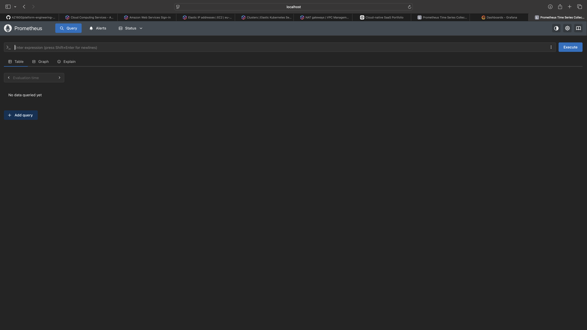
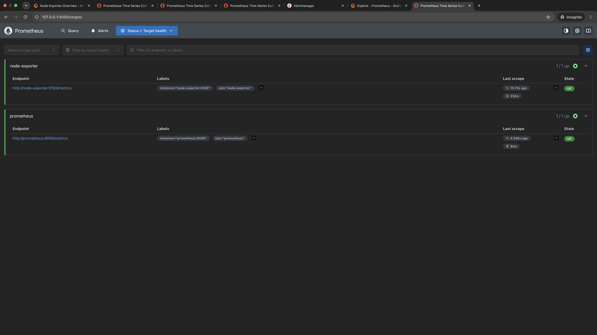
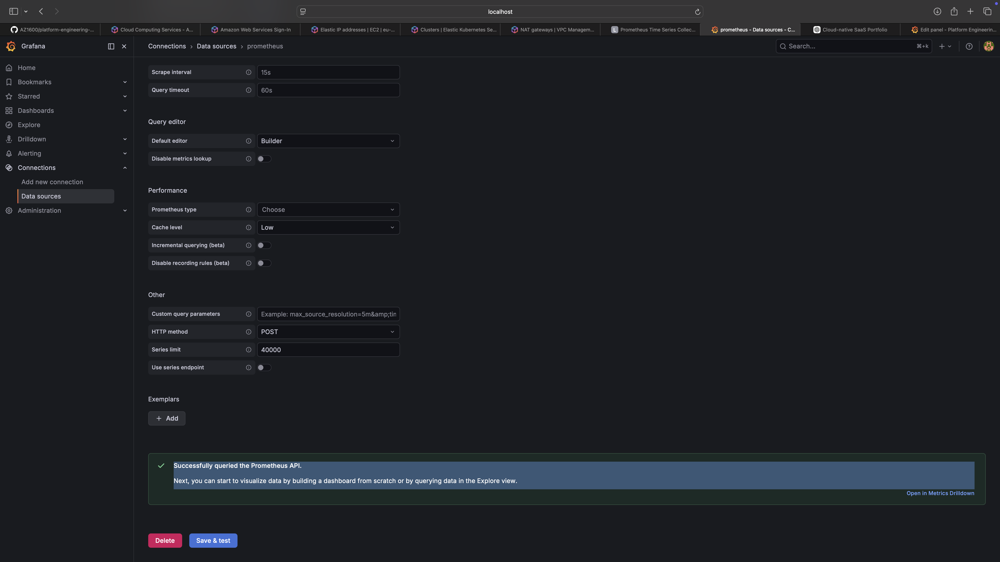
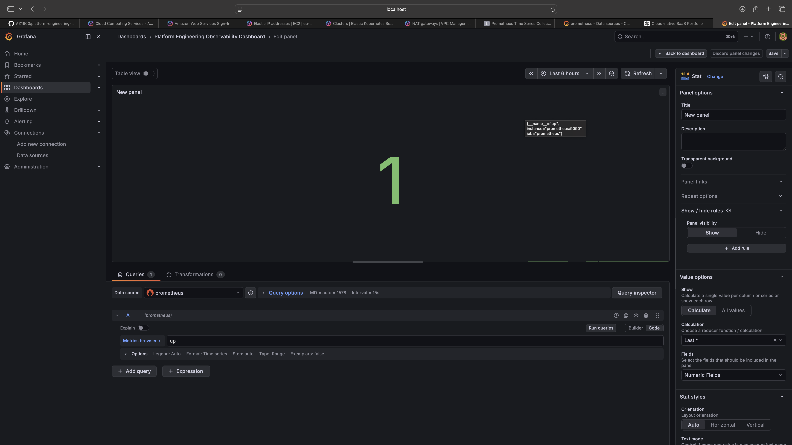

# Platform Engineering Observability

## Overview

This project demonstrates an observability platform built using Prometheus and Grafana running in Docker containers.

The solution collects metrics, monitors services, and provides dashboards for visualizing infrastructure and application health.

## Technologies Used

* Prometheus
* Grafana
* Docker
* Docker Compose

## Features

* Metrics collection
* Service monitoring
* Dashboard visualization
* Infrastructure observability
* Platform health monitoring

## Architecture

Prometheus collects metrics and Grafana visualizes them through dashboards.

## Screenshots

### Prometheus Dashboard



### Prometheus Targets



### Grafana Data Source



### Grafana Dashboard



## Running the Project

```bash
docker compose up -d
```

Prometheus:

http://localhost:9090

Grafana:

http://localhost:3000
