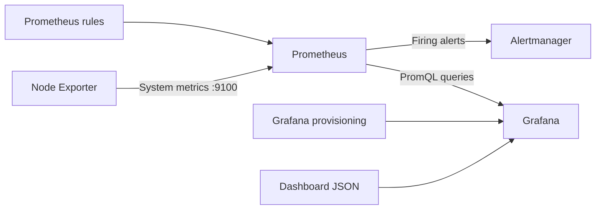

# Platform Engineering Observability

A reproducible local observability platform built with **Prometheus, Grafana, Node Exporter, Alertmanager, Docker, and Docker Compose**.

The project demonstrates:

- infrastructure metrics collection
- automated Grafana provisioning
- health monitoring
- Prometheus alert evaluation
- failure and recovery visualization
- alert routing to Alertmanager
- configuration stored in version control

## Project Showcase

### Grafana Infrastructure Dashboard

Grafana automatically provisions the **Node Exporter Overview** dashboard. It displays target health, CPU usage, memory usage, and filesystem usage.


### Prometheus Targets

Prometheus scrapes its own metrics endpoint and the Node Exporter metrics endpoint. Both targets should report `UP` during normal operation.


### Target Health and Recovery

The Prometheus `up` metric is queried from Grafana Explore.

The graph shows:

- Prometheus remaining healthy
- Node Exporter dropping from `1` to `0` during intentional outage tests
- Node Exporter returning to `1` after recovery


### Prometheus Alert Firing

The `TargetDown` rule fires when a monitored target remains unavailable for one minute.

The screenshot below shows Node Exporter unavailable with:

- `alertname="TargetDown"`
- `instance="node-exporter:9100"`
- `severity="warning"`
- state `FIRING`


### Alertmanager Alert Routing

Prometheus forwards firing alerts to Alertmanager.

Alertmanager groups the `TargetDown` alert and routes it to the configured `local` receiver.


## Architecture



## Components

- **Prometheus** collects and stores metrics.
- **Node Exporter** exposes CPU, memory, filesystem, and operating-system metrics.
- **Grafana** visualizes metrics through a provisioned infrastructure dashboard.
- **Alertmanager** receives, groups, and routes alerts generated by Prometheus.
- **Docker Compose** runs and connects the services.

## Features

- Reproducible Docker Compose deployment
- Persistent Prometheus, Grafana, and Alertmanager storage
- Automatically provisioned Grafana data source
- Automatically provisioned Grafana dashboard
- Node Exporter infrastructure monitoring
- CPU, memory, filesystem, and target-health visualization
- Prometheus alert-rule provisioning
- Target-down alert detection
- Alert routing from Prometheus to Alertmanager
- Read-only configuration mounts
- Services bound to localhost for local development

## Project Structure

```text
.
├── alertmanager/
│   └── alertmanager.yml
├── docs/
│   └── screenshots/
│       ├── alertmanager-target-down.png
│       ├── grafana-node-exporter-dashboard.png
│       ├── grafana-target-health-query.png
│       ├── prometheus-alert-firing.png
│       └── prometheus-targets.png
├── grafana/
│   ├── dashboards/
│   │   └── node-exporter.json
│   └── provisioning/
│       ├── dashboards/
│       │   └── dashboards.yml
│       └── datasources/
│           └── prometheus.yml
├── prometheus/
│   ├── prometheus.yml
│   └── rules/
│       └── targets.yml
├── docker-compose.yml
└── README.md
```

## Prerequisites

Install:

- Docker Desktop
- Docker Compose
- Git

Confirm Docker is available:

```bash
docker --version
docker compose version
```

## Running the Project

Clone the repository:

```bash
git clone https://github.com/AZ1600/platform-engineering-observability.git
cd platform-engineering-observability
```

Validate the Docker Compose configuration:

```bash
docker compose config
```

Start the platform:

```bash
docker compose up -d
```

Check the running containers:

```bash
docker compose ps
```

The following services should be running:

```text
prometheus
grafana
node-exporter
alertmanager
```

## Service URLs

| Service | URL |
|---|---|
| Grafana | `http://127.0.0.1:3000` |
| Prometheus | `http://127.0.0.1:9090` |
| Prometheus targets | `http://127.0.0.1:9090/targets` |
| Prometheus rules | `http://127.0.0.1:9090/rules` |
| Prometheus alerts | `http://127.0.0.1:9090/alerts` |
| Alertmanager | `http://127.0.0.1:9093` |

Grafana's initial local credentials are:

```text
Username: admin
Password: admin
```

Grafana may ask you to change the password during the first login.

## Verify Metrics Collection

Open the Prometheus targets page:

```text
http://127.0.0.1:9090/targets
```

Both targets should report `UP`:

```text
prometheus
node-exporter
```

In Grafana Explore, run:

```promql
up
```

You should receive one healthy result for Prometheus and one for Node Exporter.

Example:

```text
up{job="prometheus"} 1
up{job="node-exporter"} 1
```

You can also query Node Exporter metrics directly:

```promql
node_memory_MemTotal_bytes
```

## Infrastructure Dashboard

Grafana provisions the **Node Exporter Overview** dashboard automatically inside the **Infrastructure** folder.

The dashboard includes:

- Node Exporter availability
- CPU usage
- Memory usage
- Filesystem usage

The dashboard definition is stored in:

```text
grafana/dashboards/node-exporter.json
```

The provisioning configuration is stored in:

```text
grafana/provisioning/dashboards/dashboards.yml
```

## Alerting

The `TargetDown` rule detects failed Prometheus scrape targets.

The rule is stored in:

```text
prometheus/rules/targets.yml
```

The alert condition is:

```promql
up == 0
```

The alert must remain active for one minute before firing:

```yaml
for: 1m
```

### Test the Alert

Stop Node Exporter:

```bash
docker compose stop node-exporter
```

Prometheus should detect the failed scrape. The alert progresses through:

```text
INACTIVE → PENDING → FIRING
```

Open the alerts page:

```text
http://127.0.0.1:9090/alerts
```

Alertmanager should then receive the firing alert:

```text
http://127.0.0.1:9093
```

Restore Node Exporter:

```bash
docker compose start node-exporter
```

The alert resolves after Prometheus successfully scrapes Node Exporter again.

## Configuration Validation

Validate Docker Compose:

```bash
docker compose config
```

Validate the Prometheus configuration and rules:

```bash
docker compose run --rm --no-deps \
  --entrypoint /bin/promtool prometheus \
  check config /etc/prometheus/prometheus.yml
```

Validate the Alertmanager configuration:

```bash
docker compose run --rm --no-deps \
  --entrypoint /bin/amtool alertmanager \
  check-config /etc/alertmanager/alertmanager.yml
```

Validate the Grafana dashboard JSON:

```bash
python3 -m json.tool \
  grafana/dashboards/node-exporter.json > /dev/null
```

No output from the JSON command means the file is valid.

## Stopping the Platform

Stop the containers while preserving persistent data:

```bash
docker compose down
```

Stop the containers and permanently remove local persistent data:

```bash
docker compose down -v
```

The second command deletes stored Prometheus, Grafana, and Alertmanager data.

## macOS Note

When Docker Desktop runs on macOS, Node Exporter primarily reports metrics from Docker Desktop's Linux virtual machine rather than every metric from the macOS host.

## Current Scope

This repository currently provides:

- metrics collection
- infrastructure visualization
- target-health monitoring
- local alert evaluation
- failure and recovery testing
- alert routing to Alertmanager

External notification delivery through email, Slack, or Microsoft Teams is not yet configured.

# 👨‍💻 Author

**Olawale Azeez**

Cloud Engineer | Platform Engineer | AWS Solutions Architect

Focused on Platform Engineering, Internal Developer Platforms, Kubernetes, Cloud Infrastructure, and Developer Experience.

🌐 Portfolio: [Olawale Azeez Portfolio](https://az1600.github.io)

💻 GitHub: [AZ1600](https://github.com/AZ1600)

---