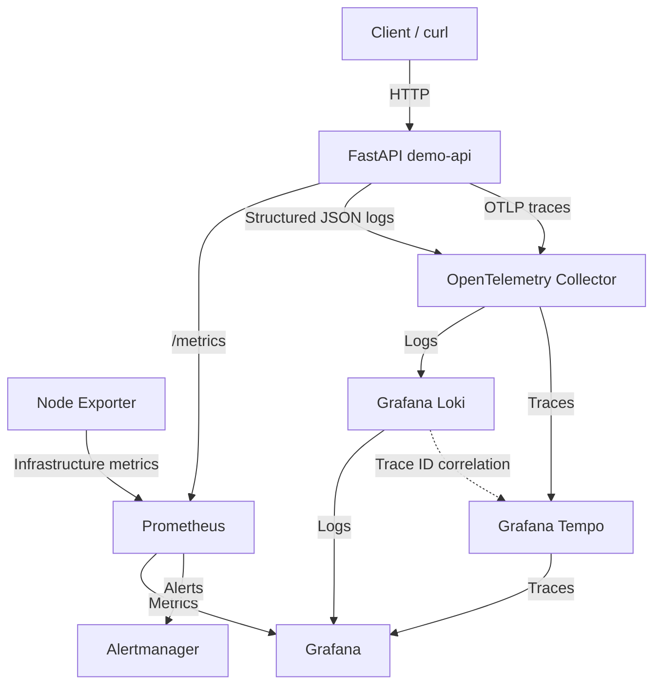

# Platform Engineering Observability

A reproducible local observability platform built with **OpenTelemetry, Prometheus, Grafana, Loki, Tempo, Node Exporter, Alertmanager, FastAPI, Docker, and Docker Compose**.

The project demonstrates practical observability across the three core telemetry signals:

```text
Metrics
Logs
Traces
```

It also demonstrates alerting, deliberate failure testing, structured logging, distributed tracing, and log-to-trace correlation.

---

# Project Overview

The platform combines infrastructure monitoring and application observability in one local environment.

```text
                    ┌─────────────────┐
                    │    FastAPI      │
                    │    demo-api     │
                    └────────┬────────┘
                             │
             ┌───────────────┼────────────────┐
             │               │                │
             │               │                │
          Metrics           Logs            Traces
             │               │                │
             v               v                v
        Prometheus     OTel Collector    OTel Collector
             │               │                │
             │               v                v
             │              Loki             Tempo
             │               │                │
             └───────────────┼────────────────┘
                             v
                           Grafana

Node Exporter
     │
     v
Prometheus
     │
     v
Grafana

Prometheus Alerts
     │
     v
Alertmanager
```

The repository currently demonstrates:

- FastAPI application instrumentation
- Prometheus application metrics
- Node Exporter infrastructure metrics
- OpenTelemetry distributed tracing
- OpenTelemetry Collector
- Grafana Tempo
- Structured JSON application logs
- Grafana Loki
- Log-to-trace correlation
- Custom application spans
- Slow request testing
- HTTP failure testing
- Grafana provisioning
- Prometheus alert rules
- Alertmanager routing
- Failure and recovery validation
- Reproducible Docker Compose deployment

---

# Architecture



---

# Observability Signals

## Metrics

Application metrics:

```text
FastAPI
   ↓
/metrics
   ↓
Prometheus
   ↓
Grafana
```

Infrastructure metrics:

```text
Node Exporter
   ↓
Prometheus
   ↓
Grafana
```

---

## Logs

The application writes structured JSON logs.

Example:

```json
{
  "level": "ERROR",
  "service": "demo-api",
  "message": "intentional application failure",
  "trace_id": "6a2a28b377efabd3b5c4ccc3314467e9",
  "span_id": "58ee7634418ccfab",
  "route": "/error",
  "status_code": 500,
  "error_type": "observability_test"
}
```

The log pipeline is:

```text
FastAPI
   ↓
JSON log
   ↓
OpenTelemetry Collector
   ↓
Loki
   ↓
Grafana
```

---

## Traces

The tracing pipeline is:

```text
FastAPI
   ↓
OpenTelemetry SDK
   ↓
OpenTelemetry Collector
   ↓
Tempo
   ↓
Grafana
```

The application contains both automatic HTTP instrumentation and custom spans.

---

# Project Showcase

## Distributed Trace

A request to:

```text
GET /work
```

produces the following trace structure:

```text
GET /work
└── perform-demo-work
    └── database-simulation
```


This demonstrates both automatic FastAPI instrumentation and custom application spans.

---

## Error Trace

The demo application contains an intentional failure endpoint:

```text
GET /error
```

which returns:

```text
HTTP/1.1 500 Internal Server Error
```

The failed request is visible through Tempo.


---

## Structured Application Logs

Application logs are written as structured JSON and collected by the OpenTelemetry Collector.

Grafana Loki makes fields such as these searchable:

```text
level
service
message
route
status_code
trace_id
span_id
duration_seconds
error_type
```


The test produced:

```text
INFO
WARNING
ERROR
```

log levels from normal, slow, and failed requests.

---

## Log-to-Trace Correlation

Each application log includes the active OpenTelemetry:

```text
trace_id
span_id
```

Grafana uses the `trace_id` as a derived field.

This creates the workflow:

```text
Loki log
   ↓
TraceID
   ↓
View Trace
   ↓
Tempo
   ↓
Matching application trace
```


This allows an operator to move directly from a log entry to the distributed trace associated with the same request.

---

## Infrastructure Dashboard

Grafana automatically provisions the Node Exporter dashboard.

It provides visibility into:

- CPU usage
- Memory usage
- Filesystem usage
- Target health


---

## Prometheus Targets

Prometheus currently scrapes:

```text
prometheus
node-exporter
demo-api
```


---

## Target Failure and Recovery

The Prometheus:

```promql
up
```

metric was used to observe an intentional Node Exporter outage.

```text
UP = 1
   ↓
Node Exporter stopped
   ↓
UP = 0
   ↓
Node Exporter restarted
   ↓
UP = 1
```


---

## Prometheus Alert

The project includes a:

```text
TargetDown
```

alert.

The rule fires when a Prometheus target remains unavailable for one minute.

```text
alertname="TargetDown"
severity="warning"
state="FIRING"
```


---

## Alertmanager

Prometheus sends firing alerts to Alertmanager.

```text
Target failure
      ↓
Prometheus
      ↓
TargetDown
      ↓
Alertmanager
```


---

# Demo Application

The FastAPI application exists specifically to generate predictable telemetry.

| Endpoint | Purpose |
|---|---|
| `GET /` | Basic application response |
| `GET /health` | Healthy request |
| `GET /work` | Normal work with nested spans |
| `GET /slow` | Intentional high-latency request |
| `GET /error` | Intentional HTTP 500 failure |
| `GET /metrics` | Prometheus metrics |

---

# `/work`

The `/work` endpoint creates nested application spans.

```text
GET /work
   |
   └── perform-demo-work
          |
          └── database-simulation
```

It also writes a structured log containing timing information.

Example fields:

```text
work_duration_seconds
database_duration_seconds
total_duration_seconds
trace_id
span_id
```

---

# `/slow`

The `/slow` endpoint intentionally takes approximately:

```text
2 seconds
```

It produces a:

```text
WARNING
```

structured log and a corresponding trace.

This allows latency investigation in both Loki and Tempo.

---

# `/error`

The `/error` endpoint intentionally returns:

```text
HTTP 500
```

and produces:

```text
ERROR
```

level structured logging.

The resulting log includes the same trace ID used by Tempo.

---

# Repository Structure

```text
.
├── alertmanager/
│   └── alertmanager.yml
│
├── app/
│   ├── Dockerfile
│   ├── main.py
│   └── requirements.txt
│
├── docs/
│   └── screenshots/
│       ├── alertmanager-target-down.png
│       ├── grafana-loki-structured-logs.png
│       ├── grafana-loki-trace-correlation.png
│       ├── grafana-node-exporter-dashboard.png
│       ├── grafana-target-health-query.png
│       ├── grafana-tempo-error-trace.png
│       ├── grafana-tempo-work-trace.png
│       ├── prometheus-alert-firing.png
│       └── prometheus-targets.png
│
├── grafana/
│   ├── dashboards/
│   │   └── node-exporter.json
│   │
│   └── provisioning/
│       ├── dashboards/
│       │   └── dashboards.yml
│       │
│       └── datasources/
│           ├── loki.yml
│           ├── prometheus.yml
│           └── tempo.yml
│
├── loki/
│   └── loki.yml
│
├── otel/
│   └── collector.yml
│
├── prometheus/
│   ├── prometheus.yml
│   └── rules/
│       └── targets.yml
│
├── tempo/
│   └── tempo.yml
│
├── docker-compose.yml
└── README.md
```

---

# Components

## FastAPI

Provides a small workload that generates predictable:

```text
Metrics
Logs
Traces
Errors
Latency
```

---

## OpenTelemetry

OpenTelemetry provides application tracing and context propagation.

Trace context is also added to structured logs.

---

## OpenTelemetry Collector

The Collector currently handles:

```text
Traces
Logs
```

Trace pipeline:

```text
OTLP
  ↓
Collector
  ↓
Tempo
```

Log pipeline:

```text
filelog receiver
      ↓
Collector
      ↓
OTLP HTTP
      ↓
Loki
```

---

## Prometheus

Prometheus collects:

```text
Application metrics
Infrastructure metrics
Target health
```

and evaluates alert rules.

---

## Node Exporter

Provides infrastructure metrics including:

- CPU
- Memory
- Filesystems
- Operating-system statistics

---

## Grafana Tempo

Tempo stores application traces.

Grafana uses Tempo for:

- Trace search
- Span inspection
- Latency investigation
- Error investigation

---

## Grafana Loki

Loki stores application logs.

Grafana uses Loki for:

- Log search
- Structured field parsing
- Log-level investigation
- Error investigation
- Trace correlation

---

## Grafana

Grafana provides a single interface for:

```text
Metrics
Logs
Traces
```

Data sources are automatically provisioned from Git.

---

## Alertmanager

Alertmanager receives alerts generated by Prometheus.

The current project uses a local receiver.

---

# Running the Platform

## Prerequisites

Install:

```text
Docker Desktop
Docker Compose
Git
```

Verify:

```bash
docker --version
docker compose version
```

---

## Clone

```bash
git clone https://github.com/AZ1600/platform-engineering-observability.git

cd platform-engineering-observability
```

---

## Validate

```bash
docker compose config
```

---

## Start

```bash
docker compose up -d --build
```

---

## Check Services

```bash
docker compose ps
```

Expected services:

```text
alertmanager
demo-api
grafana
loki
node-exporter
otel-collector
prometheus
tempo
```

---

# Service URLs

| Service | URL |
|---|---|
| Demo API | `http://127.0.0.1:8000` |
| Demo health | `http://127.0.0.1:8000/health` |
| Demo metrics | `http://127.0.0.1:8000/metrics` |
| Grafana | `http://127.0.0.1:3000` |
| Prometheus | `http://127.0.0.1:9090` |
| Prometheus targets | `http://127.0.0.1:9090/targets` |
| Prometheus alerts | `http://127.0.0.1:9090/alerts` |
| Alertmanager | `http://127.0.0.1:9093` |
| Loki | `http://127.0.0.1:3100` |
| Tempo | `http://127.0.0.1:3200` |

---

# Generate Telemetry

Generate normal traffic:

```bash
curl http://127.0.0.1:8000/health
curl http://127.0.0.1:8000/work
```

Generate latency:

```bash
curl http://127.0.0.1:8000/slow
```

Generate an intentional error:

```bash
curl -i http://127.0.0.1:8000/error
```

Expected:

```text
HTTP/1.1 500 Internal Server Error
```

---

# Verify Structured Logs

Inspect the application log:

```bash
docker compose exec demo-api \
  tail -n 10 /var/log/demo-api/app.log
```

The output should contain JSON records.

---

# Query Logs in Grafana

Open:

```text
Grafana
   ↓
Explore
   ↓
Loki
```

Run:

```logql
{service_name="demo-api"} | json
```

This parses the JSON application logs into searchable fields.

---

# Log-to-Trace Correlation

Expand a Loki log record.

The log contains:

```text
trace_id
```

Grafana exposes:

```text
TraceID
View Trace
```

Click:

```text
View Trace
```

to open the matching trace in Tempo.

This demonstrates correlation across observability signals rather than treating logs and traces as separate systems.

---

# Trace Search

Open:

```text
Grafana
   ↓
Explore
   ↓
Tempo
```

Search:

```text
Service Name = demo-api
Span Name = GET /work
```

The resulting trace should show:

```text
GET /work
└── perform-demo-work
    └── database-simulation
```

---

# Metrics

Prometheus scrapes:

```text
prometheus:9090
node-exporter:9100
demo-api:8000
```

Open:

```text
http://127.0.0.1:9090/targets
```

Expected:

```text
prometheus      UP
node-exporter   UP
demo-api        UP
```

---

# Alert Testing

Stop Node Exporter:

```bash
docker compose stop node-exporter
```

After the configured delay:

```text
TargetDown
```

should transition through:

```text
INACTIVE
   ↓
PENDING
   ↓
FIRING
```

Restore:

```bash
docker compose start node-exporter
```

---

# Configuration Validation

Validate Docker Compose:

```bash
docker compose config
```

Validate Prometheus:

```bash
docker compose run --rm --no-deps \
  --entrypoint /bin/promtool prometheus \
  check config /etc/prometheus/prometheus.yml
```

Validate Alertmanager:

```bash
docker compose run --rm --no-deps \
  --entrypoint /bin/amtool alertmanager \
  check-config /etc/alertmanager/alertmanager.yml
```

Validate dashboard JSON:

```bash
python3 -m json.tool \
  grafana/dashboards/node-exporter.json > /dev/null
```

---

# Failure Testing

The project deliberately generates failure scenarios.

## Infrastructure Failure

```text
Stop Node Exporter
      ↓
Prometheus detects target failure
      ↓
TargetDown alert
      ↓
Alertmanager
```

## Application Failure

```text
GET /error
      ↓
HTTP 500
      ↓
ERROR structured log
      ↓
Loki
      ↓
Trace ID
      ↓
Tempo
```

## Application Latency

```text
GET /slow
      ↓
~2 second request
      ↓
WARNING log
      ↓
Tempo trace
```

This makes the lab useful for investigation rather than only showing healthy dashboards.

---

# Troubleshooting Lessons

## Dockerfile Parsing

The first FastAPI image build failed because the JSON `CMD` syntax was split incorrectly.

The corrected form is:

```dockerfile
CMD ["uvicorn", "main:app", "--host", "0.0.0.0", "--port", "8000"]
```

---

## Tempo Configuration

The first Tempo configuration used settings that were not accepted by the current Tempo image.

The configuration was simplified for a local single-binary deployment.

Tempo then successfully started its:

```text
gRPC receiver :4317
HTTP receiver :4318
```

---

## Grafana Provisioning

When Loki was added, Grafana was already running.

Restarting Grafana caused it to re-read:

```text
grafana/provisioning/datasources/
```

and provision the Loki data source.

This demonstrated that provisioning files are loaded as part of the Grafana startup lifecycle.

---

# Current Coverage

```text
Infrastructure metrics        ✓
Application metrics           ✓
Distributed tracing           ✓
Custom spans                  ✓
Structured logging            ✓
Centralized logging           ✓
Log parsing                   ✓
Log-to-trace correlation      ✓
Latency investigation         ✓
Failure investigation         ✓
Prometheus alerts             ✓
Alertmanager routing          ✓
Failure/recovery testing      ✓
Grafana provisioning          ✓
```

---

# Current Limitations

This is intentionally a local engineering lab.

Current limitations include:

- Single application service
- Local Loki storage
- Local Tempo storage
- No production object storage
- No high availability
- No external alert delivery
- No authentication on local monitoring interfaces
- No Kubernetes deployment
- No production retention strategy

---

# Next Phase

The next phase will focus on **application-focused monitoring**.

The goal is to build a RED dashboard:

```text
Rate
Errors
Duration
```

Planned panels include:

```text
Request rate
HTTP error rate
P50 latency
P95 latency
P99 latency
Requests by route
Requests by status code
```

After the dashboard:

```text
Application alerts
        ↓
SLIs
        ↓
SLOs
        ↓
Error budget
```

---

# Roadmap

```text
[Complete] Prometheus
[Complete] Node Exporter
[Complete] Grafana provisioning
[Complete] Infrastructure dashboard
[Complete] Target health monitoring
[Complete] Prometheus alerts
[Complete] Alertmanager
[Complete] FastAPI workload
[Complete] OpenTelemetry tracing
[Complete] OpenTelemetry Collector
[Complete] Grafana Tempo
[Complete] Custom spans
[Complete] Slow request tracing
[Complete] Failure tracing
[Complete] Structured JSON logging
[Complete] Grafana Loki
[Complete] Log parsing
[Complete] Log-to-trace correlation

[Next] RED application dashboard
[Next] Application-level alerts
[Next] SLIs
[Next] SLOs
[Next] Error budgets
[Next] GitHub Actions validation
[Next] External Alertmanager notifications
[Future] Kubernetes deployment
```

---

# Technology Stack

**Application**

```text
Python
FastAPI
Uvicorn
```

**Telemetry**

```text
OpenTelemetry
OpenTelemetry Collector
```

**Metrics**

```text
Prometheus
Node Exporter
```

**Logs**

```text
Grafana Loki
```

**Traces**

```text
Grafana Tempo
```

**Visualization**

```text
Grafana
```

**Alerting**

```text
Prometheus Rules
Alertmanager
```

**Platform**

```text
Docker
Docker Compose
```

---

# Author

**Olawale Azeez**

Cloud Engineer | Platform Engineer | DevOps Engineer

Focused on Platform Engineering, Kubernetes, Cloud Infrastructure, Observability, Internal Developer Platforms, and Developer Experience.

Portfolio: [Olawale Azeez Portfolio](https://az1600.github.io)

GitHub: [AZ1600](https://github.com/AZ1600)