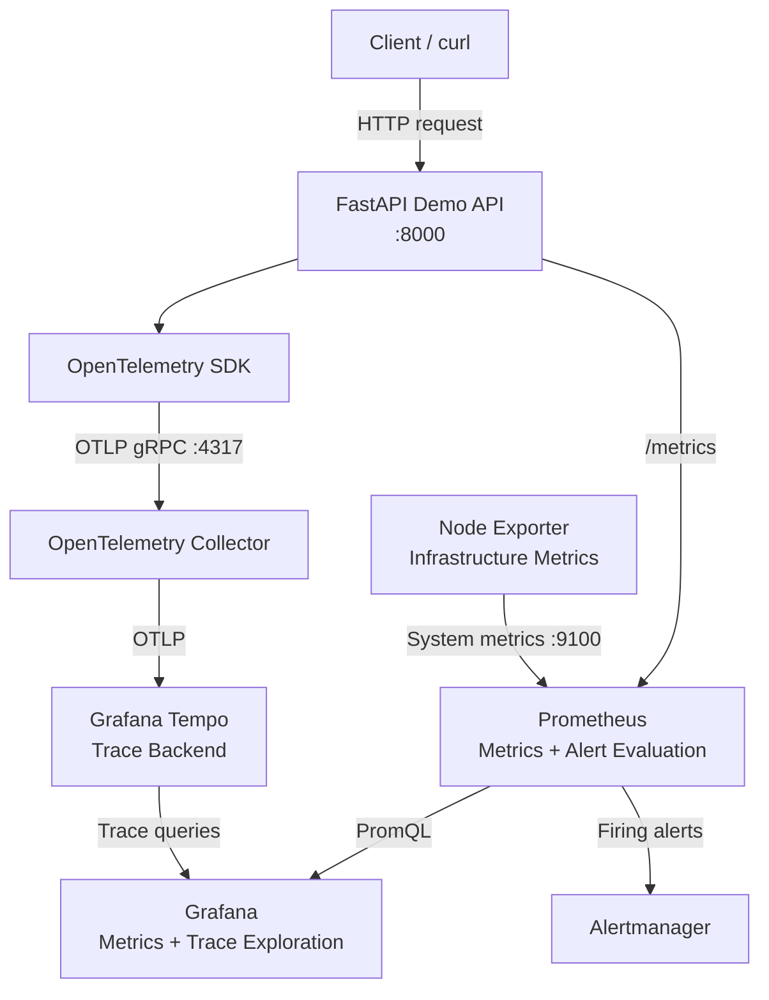

# Platform Engineering Observability

A reproducible local observability platform built with **OpenTelemetry, Prometheus, Grafana, Tempo, Node Exporter, Alertmanager, FastAPI, Docker, and Docker Compose**.

The project demonstrates both infrastructure-level and application-level observability through metrics, traces, alerting, failure testing, and automatically provisioned monitoring components.

The goal is to show how an application request can move through a complete telemetry pipeline rather than only displaying infrastructure dashboards.

```text
Application request
        ↓
OpenTelemetry
        ↓
OpenTelemetry Collector
        ↓
Grafana Tempo
        ↓
Grafana trace exploration

        +

Application metrics
        ↓
Prometheus
        ↓
Grafana

        +

Infrastructure metrics
        ↓
Node Exporter
        ↓
Prometheus
        ↓
Grafana

        +

Prometheus alert
        ↓
Alertmanager
```

---

# Project Highlights

The platform currently demonstrates:

- FastAPI application instrumentation
- OpenTelemetry tracing
- OpenTelemetry Collector
- Grafana Tempo trace storage
- Grafana trace exploration
- Custom application spans
- Successful request tracing
- Error request tracing
- Slow-request tracing
- Prometheus application metrics
- Node Exporter infrastructure metrics
- Automated Grafana provisioning
- Prometheus health monitoring
- Prometheus alert evaluation
- Alertmanager routing
- Failure and recovery testing
- Reproducible Docker Compose deployment
- Configuration stored in version control

---

# Architecture



---

# Observability Layers

The project separates observability into several layers.

## Application Tracing

```text
FastAPI
   ↓
OpenTelemetry instrumentation
   ↓
OTLP
   ↓
OpenTelemetry Collector
   ↓
Tempo
   ↓
Grafana
```

This provides request-level visibility into application execution.

---

## Application Metrics

```text
FastAPI
   ↓
/metrics
   ↓
Prometheus
   ↓
Grafana
```

The demo application exposes Prometheus-compatible HTTP metrics.

---

## Infrastructure Metrics

```text
Node Exporter
   ↓
Prometheus
   ↓
Grafana
```

Node Exporter provides CPU, memory, filesystem, and host-level metrics.

---

## Alerting

```text
Prometheus rule
      ↓
Alert state
      ↓
Alertmanager
```

Prometheus evaluates health rules and forwards firing alerts to Alertmanager.

---

# Project Showcase

## OpenTelemetry Application Trace

The FastAPI application is instrumented with OpenTelemetry.

A request to:

```text
GET /work
```

produces both automatic HTTP spans and custom application spans.

The trace contains:

```text
GET /work
   ↓
perform-demo-work
   ↓
database-simulation
```

This demonstrates that telemetry is flowing through:

```text
FastAPI
   ↓
OpenTelemetry SDK
   ↓
OpenTelemetry Collector
   ↓
Tempo
   ↓
Grafana
```


The example trace completed in approximately 315 ms and shows the relationship between the incoming HTTP request and internal application operations.

---

## Application Failure Trace

The demo API also contains an intentional failure endpoint:

```text
GET /error
```

The endpoint returns:

```text
HTTP/1.1 500 Internal Server Error
```

This provides a controlled failure scenario for investigating errors through the tracing pipeline.


This demonstrates how traces can help investigate failed application requests rather than only monitoring successful traffic.

---

## Grafana Infrastructure Dashboard

Grafana automatically provisions the **Node Exporter Overview** dashboard.

It displays:

- Target availability
- CPU usage
- Memory usage
- Filesystem usage


---

## Prometheus Targets

Prometheus collects metrics from the monitoring stack.

The project includes scrape targets for:

```text
prometheus
node-exporter
demo-api
```


The demo API exposes metrics through:

```text
GET /metrics
```

---

## Target Health and Recovery

The Prometheus:

```promql
up
```

metric can be queried through Grafana.

The recorded failure test shows:

```text
Node Exporter
    ↓
UP = 1
    ↓
Intentional outage
    ↓
UP = 0
    ↓
Recovery
    ↓
UP = 1
```


This provides visible evidence of both failure detection and recovery.

---

## Prometheus Alert Firing

The project includes a:

```text
TargetDown
```

Prometheus alert rule.

The alert fires when a monitored target remains unavailable for one minute.

The test recorded:

```text
alertname="TargetDown"
instance="node-exporter:9100"
severity="warning"
state="FIRING"
```


---

## Alertmanager Routing

Prometheus forwards firing alerts to Alertmanager.

Alertmanager groups the `TargetDown` alert and routes it to the configured local receiver.


This demonstrates the complete alert flow:

```text
Target failure
      ↓
Prometheus scrape failure
      ↓
Prometheus alert rule
      ↓
FIRING
      ↓
Alertmanager
```

---

# Demo Application

The repository includes a small FastAPI workload specifically designed for observability testing.

Available endpoints include:

| Endpoint | Purpose |
|---|---|
| `GET /` | Service information |
| `GET /health` | Successful health request |
| `GET /work` | Normal application work with nested spans |
| `GET /slow` | Intentional slow request |
| `GET /error` | Intentional HTTP 500 failure |
| `GET /metrics` | Prometheus metrics |

---

## `/work`

The `/work` endpoint creates custom spans around application operations.

Conceptually:

```text
GET /work
   |
   └── perform-demo-work
          |
          └── database-simulation
```

This makes it possible to see time spent inside individual application operations.

---

## `/slow`

The `/slow` endpoint intentionally waits approximately two seconds before returning.

It is useful for investigating:

```text
High latency
Slow traces
Request duration
```

---

## `/error`

The `/error` endpoint intentionally returns:

```text
500 Internal Server Error
```

It provides a predictable failure for trace investigation and future alert testing.

---

# Components

## FastAPI Demo API

Provides an instrumented application workload that produces:

- HTTP traces
- Custom spans
- Prometheus metrics
- Successful requests
- Slow requests
- Failed requests

---

## OpenTelemetry SDK

The application uses OpenTelemetry instrumentation to capture HTTP requests and custom spans.

Trace resource metadata includes the service name:

```text
demo-api
```

---

## OpenTelemetry Collector

The Collector receives application traces using OTLP.

```text
demo-api
   ↓
OTLP gRPC
   ↓
otel-collector:4317
```

The Collector processes traces before forwarding them to Tempo.

---

## Grafana Tempo

Tempo stores application traces.

It receives OTLP traces from the OpenTelemetry Collector and makes them available to Grafana.

The project uses local Tempo storage for development and demonstration purposes.

---

## Prometheus

Prometheus collects metrics and evaluates alert rules.

Current scrape targets include:

```text
prometheus:9090
node-exporter:9100
demo-api:8000
```

---

## Node Exporter

Node Exporter exposes infrastructure metrics including:

- CPU
- Memory
- Filesystem
- Operating-system statistics

---

## Grafana

Grafana provides one interface for:

```text
Prometheus metrics
+
Tempo traces
```

Both data sources are provisioned automatically from version-controlled configuration.

---

## Alertmanager

Alertmanager receives, groups, and routes alerts generated by Prometheus.

The current repository uses a local receiver for demonstration.

External delivery such as Slack, Microsoft Teams, PagerDuty, or email is not yet configured.

---

# Repository Structure

```text
.
├── alertmanager/
│   └── alertmanager.yml
│
├── app/
│   ├── Dockerfile
│   ├── main.py
│   └── requirements.txt
│
├── docs/
│   └── screenshots/
│       ├── alertmanager-target-down.png
│       ├── grafana-node-exporter-dashboard.png
│       ├── grafana-target-health-query.png
│       ├── grafana-tempo-error-trace.png
│       ├── grafana-tempo-work-trace.png
│       ├── prometheus-alert-firing.png
│       └── prometheus-targets.png
│
├── grafana/
│   ├── dashboards/
│   │   └── node-exporter.json
│   │
│   └── provisioning/
│       ├── dashboards/
│       │   └── dashboards.yml
│       │
│       └── datasources/
│           ├── prometheus.yml
│           └── tempo.yml
│
├── otel/
│   └── collector.yml
│
├── prometheus/
│   ├── prometheus.yml
│   │
│   └── rules/
│       └── targets.yml
│
├── tempo/
│   └── tempo.yml
│
├── docker-compose.yml
└── README.md
```

---

# Running the Platform

## Prerequisites

Install:

- Docker Desktop
- Docker Compose
- Git

Verify Docker:

```bash
docker --version
docker compose version
```

---

## Clone the Repository

```bash
git clone https://github.com/AZ1600/platform-engineering-observability.git

cd platform-engineering-observability
```

---

## Validate Docker Compose

```bash
docker compose config
```

A successful command should render the final Compose configuration without errors.

---

## Build and Start

Because the repository now includes the custom FastAPI image, use:

```bash
docker compose up -d --build
```

---

## Verify Containers

```bash
docker compose ps
```

The following seven services should be running:

```text
alertmanager
demo-api
grafana
node-exporter
otel-collector
prometheus
tempo
```

---

# Service URLs

| Service | URL |
|---|---|
| Demo API | `http://127.0.0.1:8000` |
| API health | `http://127.0.0.1:8000/health` |
| API metrics | `http://127.0.0.1:8000/metrics` |
| Grafana | `http://127.0.0.1:3000` |
| Prometheus | `http://127.0.0.1:9090` |
| Prometheus targets | `http://127.0.0.1:9090/targets` |
| Prometheus rules | `http://127.0.0.1:9090/rules` |
| Prometheus alerts | `http://127.0.0.1:9090/alerts` |
| Alertmanager | `http://127.0.0.1:9093` |
| Tempo HTTP endpoint | `http://127.0.0.1:3200` |

Grafana's initial local credentials are:

```text
Username: admin
Password: admin
```

Grafana may request a password change after the first login.

---

# Generate Application Telemetry

Generate normal traffic:

```bash
curl http://127.0.0.1:8000/health

curl http://127.0.0.1:8000/work

curl http://127.0.0.1:8000/work
```

Generate a slow request:

```bash
curl http://127.0.0.1:8000/slow
```

Generate an intentional error:

```bash
curl -i http://127.0.0.1:8000/error
```

Expected response:

```text
HTTP/1.1 500 Internal Server Error
```

---

# Verify Prometheus Metrics

Check the application's metrics endpoint:

```bash
curl -s http://127.0.0.1:8000/metrics | head -40
```

Open Prometheus targets:

```text
http://127.0.0.1:9090/targets
```

Expected targets:

```text
prometheus      UP
node-exporter   UP
demo-api        UP
```

In Grafana Explore, select Prometheus and run:

```promql
up
```

The query should show healthy scrape targets.

---

# Verify OpenTelemetry Tracing

Generate a request:

```bash
curl http://127.0.0.1:8000/work
```

Open Grafana:

```text
http://127.0.0.1:3000
```

Navigate to:

```text
Explore
   ↓
Tempo
```

Search using:

```text
Service Name = demo-api
Span Name = GET /work
```

The resulting trace should contain:

```text
GET /work
   ↓
perform-demo-work
   ↓
database-simulation
```

The equivalent TraceQL concept is:

```text
{ resource.service.name = "demo-api" && name = "GET /work" }
```

---

# Verify Failure Tracing

Generate an intentional failure:

```bash
curl -i http://127.0.0.1:8000/error
```

Then search Tempo using:

```text
Service Name = demo-api
Span Name = GET /error
```

This provides a repeatable failure investigation exercise.

---

# OpenTelemetry Pipeline

The application exports traces through OTLP gRPC:

```text
demo-api
   |
   | OTLP
   | port 4317
   v
OpenTelemetry Collector
   |
   | OTLP
   v
Tempo
```

The Collector configuration is stored in:

```text
otel/collector.yml
```

The Tempo configuration is stored in:

```text
tempo/tempo.yml
```

---

# Grafana Data Sources

Grafana data sources are provisioned automatically.

## Prometheus

Configuration:

```text
grafana/provisioning/datasources/prometheus.yml
```

Used for:

```text
Infrastructure metrics
Application metrics
PromQL
```

---

## Tempo

Configuration:

```text
grafana/provisioning/datasources/tempo.yml
```

Used for:

```text
Application traces
Trace search
Span inspection
Latency investigation
Failure investigation
```

---

# Infrastructure Dashboard

Grafana provisions the **Node Exporter Overview** dashboard inside the:

```text
Infrastructure
```

folder.

The dashboard includes:

- Node Exporter availability
- CPU usage
- Memory usage
- Filesystem usage

Dashboard definition:

```text
grafana/dashboards/node-exporter.json
```

Provisioning configuration:

```text
grafana/provisioning/dashboards/dashboards.yml
```

---

# Alerting

The `TargetDown` rule detects failed Prometheus scrape targets.

The rule is stored in:

```text
prometheus/rules/targets.yml
```

The alert expression is:

```promql
up == 0
```

The condition must remain true for one minute:

```yaml
for: 1m
```

before the alert fires.

---

## Test Target Failure

Stop Node Exporter:

```bash
docker compose stop node-exporter
```

Prometheus should detect the failed scrape.

The alert progresses through:

```text
INACTIVE
   ↓
PENDING
   ↓
FIRING
```

Check Prometheus alerts:

```text
http://127.0.0.1:9090/alerts
```

Check Alertmanager:

```text
http://127.0.0.1:9093
```

Restore the target:

```bash
docker compose start node-exporter
```

The alert should resolve after successful scraping resumes.

---

# Configuration Validation

## Docker Compose

```bash
docker compose config
```

---

## Prometheus

```bash
docker compose run --rm --no-deps \
  --entrypoint /bin/promtool prometheus \
  check config /etc/prometheus/prometheus.yml
```

---

## Alertmanager

```bash
docker compose run --rm --no-deps \
  --entrypoint /bin/amtool alertmanager \
  check-config /etc/alertmanager/alertmanager.yml
```

---

## Grafana Dashboard JSON

```bash
python3 -m json.tool \
  grafana/dashboards/node-exporter.json > /dev/null
```

No output means the JSON parsed successfully.

---

# Troubleshooting

## Tempo Configuration Compatibility

During the tracing implementation, the first Tempo configuration used settings that were not accepted by the current Tempo image.

Tempo repeatedly restarted with configuration parsing errors involving:

```text
ingester
compactor
```

The configuration was simplified for the current local single-binary Tempo deployment.

After correction, Tempo successfully started:

```text
Starting GRPC server
Starting HTTP server
Tempo started
```

This reinforced the importance of validating configuration against the actual software version being deployed.

---

## Dockerfile Parsing

The first FastAPI Docker build failed because the JSON-form `CMD` instruction had been split incorrectly across multiple Dockerfile lines.

Docker interpreted:

```text
"uvicorn",
```

as a Dockerfile instruction.

The command was corrected to:

```dockerfile
CMD ["uvicorn", "main:app", "--host", "0.0.0.0", "--port", "8000"]
```

After rebuilding, the demo API started successfully.

---

# Failure Testing Philosophy

This project intentionally creates failures rather than only displaying healthy dashboards.

Examples include:

```text
Node Exporter stopped
        ↓
Prometheus target DOWN
        ↓
TargetDown alert
        ↓
Alertmanager

GET /error
        ↓
HTTP 500
        ↓
OpenTelemetry trace
        ↓
Tempo
        ↓
Grafana investigation

GET /slow
        ↓
~2 second request
        ↓
Trace latency visible
```

This makes the project useful for practising investigation and recovery rather than only configuration.

---

# Current Observability Coverage

The project currently covers:

```text
Infrastructure metrics
        ✓

Application metrics
        ✓

Application tracing
        ✓

Custom spans
        ✓

Latency investigation
        ✓

Failure traces
        ✓

Prometheus alerting
        ✓

Alert routing
        ✓

Failure/recovery testing
        ✓

Provisioned dashboards
        ✓
```

---

# Current Limitations

This is a local platform-engineering lab rather than a production monitoring platform.

Current limitations include:

- Single demo application service
- Local Tempo storage
- No central application log aggregation yet
- No Loki integration yet
- No production alert notification receiver
- No authentication on local monitoring services
- No high availability
- No Kubernetes deployment
- No remote object storage for telemetry

These are deliberate boundaries for the current phase.

---

# Next Phase

The next major improvement is **centralized application logging**.

Planned architecture:

```text
Application logs
      ↓
Collector / log pipeline
      ↓
Grafana Loki
      ↓
Grafana
```

This will extend the project from:

```text
Metrics + Traces
```

to:

```text
Metrics + Logs + Traces
```

After Loki, planned improvements include:

- structured application logging
- correlation between logs and traces
- RED application dashboard
- request-rate visualization
- error-rate visualization
- latency percentiles
- application-level Prometheus alert rules
- SLOs and SLIs
- GitHub Actions configuration validation
- external Alertmanager notification integration
- Kubernetes deployment

---

# Engineering Lessons

This project demonstrates several important observability principles.

## Metrics and traces answer different questions

Metrics can show:

```text
Something is slow
Something is failing
A target is unavailable
```

Traces can help show:

```text
Where time was spent
Which operation failed
How a request moved through the application
```

Using both provides stronger operational evidence.

---

## Healthy infrastructure does not guarantee a healthy application

A server can be running while the application returns errors.

That is why the project monitors both:

```text
Infrastructure
+
Application behaviour
```

---

## Instrumentation should be tested with deliberate failures

Successful requests alone do not prove that an observability platform is useful during incidents.

The project deliberately generates:

```text
Target outages
HTTP 500 responses
Slow requests
```

and verifies that they are visible in the telemetry systems.

---

## Observability configuration should be reproducible

Prometheus rules, Grafana provisioning, Tempo configuration, OpenTelemetry Collector configuration, and Docker Compose definitions are stored in Git.

This makes the monitoring environment repeatable instead of depending on manually configured dashboards and services.

---

# Stopping the Platform

Stop all containers while preserving persistent volumes:

```bash
docker compose down
```

Remove the platform and persistent local data:

```bash
docker compose down -v
```

The second command permanently deletes local Docker volume data for services such as Prometheus, Grafana, Alertmanager, and Tempo.

---

# macOS Note

When Docker Desktop runs on macOS, Node Exporter primarily reports metrics from Docker Desktop's Linux virtual machine rather than every metric from the macOS host.

This is expected for this local environment.

---

# Technology Stack

## Application

- Python
- FastAPI
- Uvicorn

## Telemetry

- OpenTelemetry SDK
- OpenTelemetry Collector

## Metrics

- Prometheus
- Node Exporter

## Tracing

- Grafana Tempo

## Visualization

- Grafana

## Alerting

- Prometheus alert rules
- Alertmanager

## Platform

- Docker
- Docker Compose

---

# Skills Demonstrated

This repository demonstrates practical experience with:

- Observability engineering
- Platform engineering
- OpenTelemetry
- Distributed tracing concepts
- Prometheus
- PromQL
- Grafana
- Grafana Tempo
- Node Exporter
- Alertmanager
- FastAPI instrumentation
- Custom application spans
- HTTP failure investigation
- Latency investigation
- Metrics collection
- Alert management
- Docker
- Docker Compose
- Configuration as Code
- Failure testing
- Troubleshooting

---

# Roadmap

```text
[Complete] Prometheus metrics
[Complete] Node Exporter
[Complete] Grafana provisioning
[Complete] Infrastructure dashboard
[Complete] Target health monitoring
[Complete] Prometheus alerts
[Complete] Alertmanager routing
[Complete] FastAPI demo workload
[Complete] OpenTelemetry instrumentation
[Complete] OpenTelemetry Collector
[Complete] Grafana Tempo
[Complete] Application trace search
[Complete] Custom nested spans
[Complete] HTTP failure trace
[Complete] Slow-request test

[Next] Structured application logs
[Next] Grafana Loki
[Next] Log and trace correlation
[Next] RED dashboard
[Next] Application alerts
[Next] SLOs and SLIs
[Next] GitHub Actions validation
[Next] External alert notifications
[Future] Kubernetes deployment
```

---

# Author

**Olawale Azeez**

Cloud Engineer | Platform Engineer | DevOps Engineer

Focused on Platform Engineering, Internal Developer Platforms, Kubernetes, Cloud Infrastructure, Observability, and Developer Experience.

Portfolio: [Olawale Azeez Portfolio](https://az1600.github.io)

GitHub: [AZ1600](https://github.com/AZ1600)