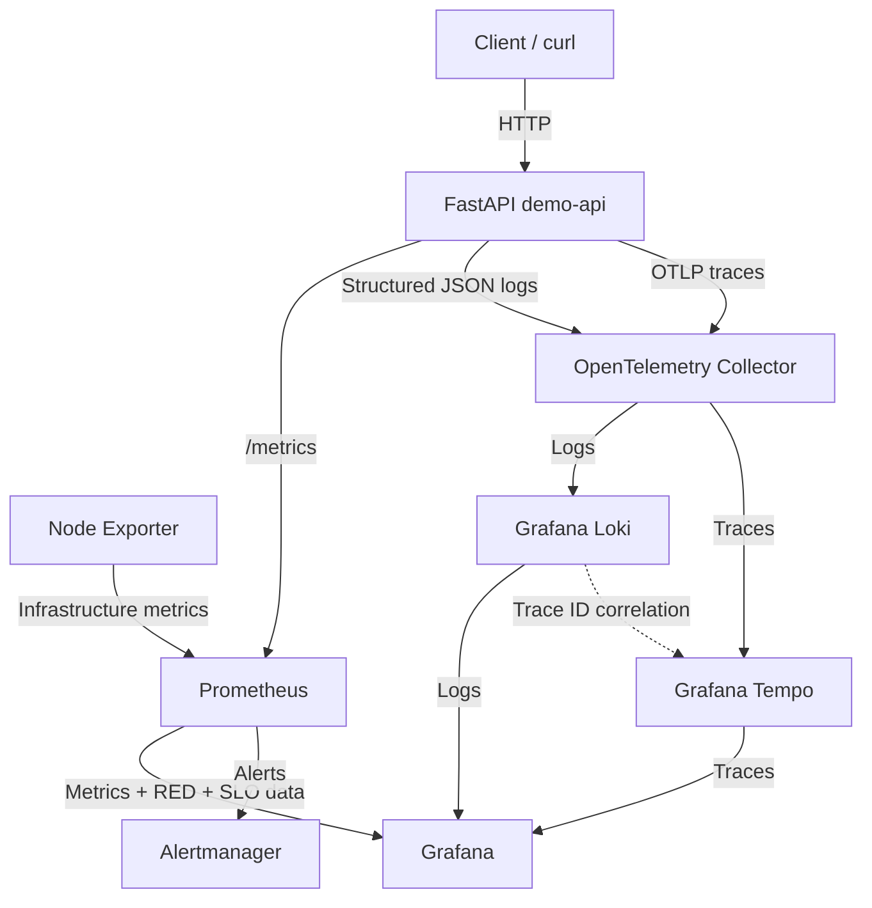
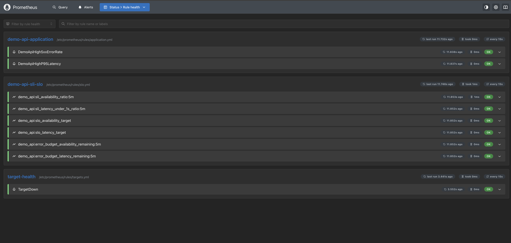

# Platform Engineering Observability

A reproducible local observability platform built with **OpenTelemetry, Prometheus, Grafana, Loki, Tempo, Node Exporter, Alertmanager, FastAPI, Docker, and Docker Compose**.

The project demonstrates practical observability across the three core telemetry signals:

```text
Metrics
Logs
Traces
```

It also demonstrates:

- application-level RED monitoring
- structured application logging
- distributed tracing
- log-to-trace correlation
- infrastructure monitoring
- Prometheus application alerting
- Alertmanager routing
- Service Level Indicators
- Service Level Objectives
- error budget monitoring
- deliberate latency and failure testing
- configuration-as-code for dashboards and monitoring components

---

# Project Overview

The platform combines infrastructure monitoring and application observability in one local environment.

```text
                    ┌─────────────────┐
                    │    FastAPI      │
                    │    demo-api     │
                    └────────┬────────┘
                             │
             ┌───────────────┼────────────────┐
             │               │                │
          Metrics           Logs            Traces
             │               │                │
             v               v                v
        Prometheus     OTel Collector    OTel Collector
             │               │                │
             │               v                v
             │              Loki             Tempo
             │               │                │
             └───────────────┼────────────────┘
                             v
                           Grafana

Node Exporter
     │
     v
Prometheus
     │
     v
Grafana

Prometheus Rules
     │
     v
Alertmanager

RED Metrics
     │
     v
SLIs
     │
     v
SLOs
     │
     v
Error Budgets
```

The repository currently demonstrates:

- FastAPI application instrumentation
- Prometheus application metrics
- Node Exporter infrastructure metrics
- RED application monitoring
- request-rate monitoring
- HTTP error-rate monitoring
- P50, P95, and P99 latency
- route-level metrics
- application-level Prometheus alerts
- OpenTelemetry distributed tracing
- custom application spans
- structured JSON logs
- Grafana Loki
- Grafana Tempo
- log-to-trace correlation
- availability SLI
- latency SLI
- availability SLO
- latency SLO
- error budget calculation
- Grafana dashboard provisioning
- Alertmanager routing
- failure and recovery validation
- reproducible Docker Compose deployment

---

# Architecture



---

# Observability Model

The project currently covers:

```text
Metrics
  +
Logs
  +
Traces
  +
Alerting
  +
SLIs / SLOs
```

Each signal answers a different operational question.

## Metrics

```text
How much traffic is the service receiving?
How many requests are failing?
How slow is the service?
Is infrastructure healthy?
```

## Logs

```text
What event occurred?
What request failed?
What structured fields were recorded?
```

## Traces

```text
Where did the request spend time?
Which internal operation was slow?
Which trace belongs to a log entry?
```

## Alerts

```text
When has a failure condition persisted long enough to require attention?
```

## SLIs and SLOs

```text
How reliably is the service meeting defined objectives?
How much failure is acceptable?
How much error budget remains?
```

---

# RED Application Monitoring

The application dashboard follows the RED method:

```text
R = Rate
E = Errors
D = Duration
```

This focuses monitoring on three questions:

```text
How much traffic is the service receiving?

How many requests are failing?

How long are requests taking?
```

---

# Demo API RED Dashboard

Grafana automatically provisions:

```text
Demo API RED Dashboard
```

from:

```text
grafana/dashboards/demo-api-red.json
```

The dashboard includes:

- Request Rate
- HTTP 5xx Error Rate
- P50 Latency
- P95 Latency
- P99 Latency
- Request Rate by Route
- Request Rate by Status Code
- Average Latency by Route
- Error Rate by Route


A deliberate traffic test generated:

```text
normal requests
slow requests
HTTP 500 failures
```

One validation run showed approximately:

```text
Request Rate
0.11 req/s

HTTP 5xx Error Rate
16.67%

P50 Latency
137.5 ms

P95 Latency
2.255 s

P99 Latency
2.451 s
```

These values are test-specific.

The important result is that `/slow` increased latency while `/error` generated visible 5xx traffic and route-level failures.

---

# RED PromQL

## Request Rate

```promql
sum(
  rate(
    http_requests_total{
      handler!="/metrics"
    }[5m]
  )
)
```

The `/metrics` endpoint is excluded so Prometheus scraping does not distort application traffic.

---

## HTTP 5xx Error Rate

```promql
100 *
sum(
  rate(
    http_requests_total{
      handler!="/metrics",
      status=~"5.."
    }[5m]
  )
)
/
clamp_min(
  sum(
    rate(
      http_requests_total{
        handler!="/metrics"
      }[5m]
    )
  ),
  0.000001
)
```

---

## P50 Latency

```promql
histogram_quantile(
  0.50,
  sum(
    rate(
      http_request_duration_highr_seconds_bucket[5m]
    )
  ) by (le)
)
```

---

## P95 Latency

```promql
histogram_quantile(
  0.95,
  sum(
    rate(
      http_request_duration_highr_seconds_bucket[5m]
    )
  ) by (le)
)
```

---

## P99 Latency

```promql
histogram_quantile(
  0.99,
  sum(
    rate(
      http_request_duration_highr_seconds_bucket[5m]
    )
  ) by (le)
)
```

---

# Application-Level Alerting

The RED metrics are also used for application-level Prometheus alerts.

The rules are stored in:

```text
prometheus/rules/application.yml
```

The current application alerts are:

```text
DemoApiHigh5xxErrorRate
DemoApiHighP95Latency
```

---

## High 5xx Error Rate

The `DemoApiHigh5xxErrorRate` alert detects sustained HTTP server errors.

Condition:

```text
5xx error rate > 10%
for at least 1 minute
```

The alert flow is:

```text
FastAPI failures
      ↓
http_requests_total
      ↓
Prometheus
      ↓
5xx rate > 10%
      ↓
PENDING
      ↓
FIRING
      ↓
Alertmanager
```

---

## High P95 Latency

The `DemoApiHighP95Latency` alert detects sustained application latency.

Condition:

```text
P95 latency > 1 second
for at least 1 minute
```

The alert flow is:

```text
Slow requests
      ↓
Request duration histogram
      ↓
P95 calculation
      ↓
P95 > 1 second
      ↓
PENDING
      ↓
FIRING
      ↓
Alertmanager
```

---

## Rule Health

Prometheus successfully loads the application alert rules alongside the infrastructure rule.


The active rules include:

```text
DemoApiHigh5xxErrorRate
DemoApiHighP95Latency
TargetDown
```

---

## Application Alert Validation

Deliberate `/error` and `/slow` traffic was generated for more than one minute.

Both application alerts reached the firing state.


This confirms that the RED metrics can drive operational alerting rather than only dashboard visualization.

---

## Alertmanager Routing

Both application alerts were successfully forwarded to Alertmanager.


Alertmanager received:

```text
DemoApiHigh5xxErrorRate
DemoApiHighP95Latency
```

The complete path is:

```text
Application behaviour
        ↓
Prometheus metrics
        ↓
Alert expression
        ↓
Prometheus alert
        ↓
Alertmanager
```

---

# SLI, SLO and Error Budget Monitoring

The project builds Service Level Indicators and Service Level Objectives on top of the existing application metrics.

The current lab objectives are:

```text
Availability SLO
99% successful requests

Latency SLO
95% of requests complete within 1 second
```

The recording rules are stored in:

```text
prometheus/rules/slo.yml
```

These use a short five-minute window to make SLO behaviour easy to test locally.

A production SLO would normally use a significantly longer rolling measurement period.

---

# Availability SLI

The availability SLI measures the proportion of requests that do not return a 5xx response.

```text
Successful non-5xx requests
          /
All application requests
```

Prometheus records:

```text
demo_api:sli_availability_ratio:5m
```

The `/metrics` endpoint is excluded from the calculation.

---

# Latency SLI

The latency SLI measures the proportion of application requests completed within one second.

```text
Requests completed within 1 second
                /
Total application requests
```

Prometheus records:

```text
demo_api:sli_latency_under_1s_ratio:5m
```

---

# SLO Targets

The lab defines:

```text
Availability SLO = 99%
Latency SLO      = 95%
```

These are exposed as recording rules:

```text
demo_api:slo_availability_target
demo_api:slo_latency_target
```

---

# Error Budgets

An SLO deliberately allows a limited amount of failure.

For the availability objective:

```text
99% SLO
→ 1% failure budget
```

For the latency objective:

```text
95% SLO
→ 5% slow-request budget
```

The remaining error budget is calculated from the measured SLI.

```text
SLI
 ↓
SLO target
 ↓
Allowed failure
 ↓
Error budget remaining
```

Prometheus records:

```text
demo_api:error_budget_availability_remaining:5m
demo_api:error_budget_latency_remaining:5m
```

The values are constrained between:

```text
0% and 100%
```

---

# No-Traffic Handling

The SLI rules only calculate a value when real application traffic exists.

```text
No application traffic
        ↓
No new SLI sample
```

This prevents an idle application from being incorrectly represented as:

```text
0% availability
```

No traffic and failed traffic are therefore treated as different operational conditions.

---

# SLI/SLO Recording Rule Health

Prometheus successfully loads all six SLI/SLO recording rules.



The rule group contains:

```text
Availability SLI
Latency SLI
Availability SLO target
Latency SLO target
Availability error budget remaining
Latency error budget remaining
```

---

# SLO and Error Budget Dashboard

Grafana automatically provisions:

```text
Demo API SLO & Error Budget
```

from:

```text
grafana/dashboards/demo-api-slo.json
```

The dashboard displays:

```text
Availability SLI
Availability SLO
Availability Error Budget Remaining

Latency SLI
Latency SLO
Latency Error Budget Remaining

Availability SLI vs SLO
Latency SLI vs SLO
Error Budget Remaining
```


During deliberate failure testing, one short test window produced:

```text
Availability SLI = 50%
Availability SLO = 99%

Latency SLI      = 50%
Latency SLO      = 95%
```

Both error budgets reached:

```text
0%
```

This shows that the generated failure and latency traffic exceeded the amount permitted by the defined objectives.

---

# Observability Signals

## Application Metrics

```text
FastAPI
   ↓
/metrics
   ↓
Prometheus
   ↓
Grafana
   ↓
RED Dashboard
   ↓
SLIs / SLOs
```

---

## Infrastructure Metrics

```text
Node Exporter
   ↓
Prometheus
   ↓
Grafana
```

---

## Logs

The application writes structured JSON logs.

Example:

```json
{
  "level": "ERROR",
  "service": "demo-api",
  "message": "intentional application failure",
  "trace_id": "6a2a28b377efabd3b5c4ccc3314467e9",
  "span_id": "58ee7634418ccfab",
  "route": "/error",
  "status_code": 500,
  "error_type": "observability_test"
}
```

The log pipeline is:

```text
FastAPI
   ↓
JSON log
   ↓
OpenTelemetry Collector
   ↓
Loki
   ↓
Grafana
```

---

## Traces

The tracing pipeline is:

```text
FastAPI
   ↓
OpenTelemetry SDK
   ↓
OpenTelemetry Collector
   ↓
Tempo
   ↓
Grafana
```

The application contains automatic HTTP instrumentation and custom spans.

---

# Project Showcase

## RED Dashboard

The application dashboard provides a single operational view of:

```text
Rate
Errors
Duration
```


---

## SLO Dashboard

The SLO dashboard converts RED metrics into reliability objectives.

```text
Application metrics
       ↓
SLIs
       ↓
SLO targets
       ↓
Error budget
```


---

## Distributed Trace

A request to:

```text
GET /work
```

produces:

```text
GET /work
└── perform-demo-work
    └── database-simulation
```


This demonstrates automatic HTTP instrumentation and custom application spans.

---

## Error Trace

The application contains an intentional failure endpoint:

```text
GET /error
```

which returns:

```text
HTTP/1.1 500 Internal Server Error
```

The failed request is visible through Tempo.


---

## Structured Application Logs

Application logs are written as structured JSON and collected by the OpenTelemetry Collector.

Grafana Loki exposes fields including:

```text
level
service
message
route
status_code
trace_id
span_id
duration_seconds
error_type
```


The test workload generates:

```text
INFO
WARNING
ERROR
```

events.

---

## Log-to-Trace Correlation

Each application log contains:

```text
trace_id
span_id
```

Grafana uses the trace ID as a derived field.

```text
Loki log
   ↓
TraceID
   ↓
View Trace
   ↓
Tempo
   ↓
Matching application trace
```


---

## Infrastructure Dashboard

Grafana also provisions the Node Exporter infrastructure dashboard.

It provides:

- CPU usage
- memory usage
- filesystem usage
- target health


---

## Prometheus Targets

Prometheus scrapes:

```text
prometheus
node-exporter
demo-api
```


---

## Infrastructure Failure and Recovery

The Prometheus:

```promql
up
```

metric was used during a deliberate Node Exporter outage.

```text
UP = 1
   ↓
Node Exporter stopped
   ↓
UP = 0
   ↓
Node Exporter restarted
   ↓
UP = 1
```


---

## Infrastructure Alert

The project includes a:

```text
TargetDown
```

alert.

It fires when a monitored target remains unavailable for one minute.


---

## Alertmanager

Prometheus forwards firing alerts to Alertmanager.

```text
Target failure
      ↓
Prometheus
      ↓
Alert rule
      ↓
Alertmanager
```


---

# Demo Application

The FastAPI application exists specifically to generate predictable telemetry.

| Endpoint | Purpose |
|---|---|
| `GET /` | Basic application response |
| `GET /health` | Healthy request |
| `GET /work` | Normal work with nested spans |
| `GET /slow` | Intentional high-latency request |
| `GET /error` | Intentional HTTP 500 failure |
| `GET /metrics` | Prometheus metrics |

---

# `/work`

The `/work` endpoint creates nested spans:

```text
GET /work
   |
   └── perform-demo-work
          |
          └── database-simulation
```

It also produces structured timing fields:

```text
work_duration_seconds
database_duration_seconds
total_duration_seconds
trace_id
span_id
```

---

# `/slow`

The `/slow` endpoint intentionally takes approximately:

```text
2 seconds
```

It produces:

```text
WARNING log
+
high latency metric
+
Tempo trace
+
latency SLI impact
```

---

# `/error`

The `/error` endpoint intentionally returns:

```text
HTTP 500
```

and produces:

```text
ERROR log
+
5xx metric
+
Tempo trace
+
availability SLI impact
```

---

# Repository Structure

```text
.
├── alertmanager/
│   └── alertmanager.yml
│
├── app/
│   ├── Dockerfile
│   ├── main.py
│   └── requirements.txt
│
├── docs/
│   └── screenshots/
│       ├── alertmanager-application-alerts.png
│       ├── alertmanager-target-down.png
│       ├── grafana-demo-api-red-dashboard.png
│       ├── grafana-loki-structured-logs.png
│       ├── grafana-loki-trace-correlation.png
│       ├── grafana-node-exporter-dashboard.png
│       ├── grafana-slo-error-budget.png
│       ├── grafana-target-health-query.png
│       ├── grafana-tempo-error-trace.png
│       ├── grafana-tempo-work-trace.png
│       ├── prometheus-alert-firing.png
│       ├── prometheus-application-alerts.png
│       ├── prometheus-application-rule-health.png
│       ├── prometheus-sli-slo-rule-health.png
│       └── prometheus-targets.png
│
├── grafana/
│   ├── dashboards/
│   │   ├── demo-api-red.json
│   │   ├── demo-api-slo.json
│   │   └── node-exporter.json
│   │
│   └── provisioning/
│       ├── dashboards/
│       │   └── dashboards.yml
│       │
│       └── datasources/
│           ├── loki.yml
│           ├── prometheus.yml
│           └── tempo.yml
│
├── loki/
│   └── loki.yml
│
├── otel/
│   └── collector.yml
│
├── prometheus/
│   ├── prometheus.yml
│   └── rules/
│       ├── application.yml
│       ├── slo.yml
│       └── targets.yml
│
├── tempo/
│   └── tempo.yml
│
├── docker-compose.yml
└── README.md
```

---

# Components

## FastAPI

Provides a predictable workload that generates:

```text
Metrics
Logs
Traces
Errors
Latency
```

---

## Prometheus

Prometheus collects:

```text
Application metrics
Infrastructure metrics
Target health
```

It also evaluates:

```text
Infrastructure alert rules
Application alert rules
SLI/SLO recording rules
```

---

## Grafana

Grafana provides one interface for:

```text
Infrastructure dashboards
RED application monitoring
SLO monitoring
Logs
Traces
```

Dashboards and data sources are provisioned from Git.

---

## OpenTelemetry

OpenTelemetry provides tracing and context propagation.

Trace IDs are also written into structured logs.

---

## OpenTelemetry Collector

The Collector currently handles:

```text
Traces
Logs
```

Trace pipeline:

```text
OTLP
  ↓
Collector
  ↓
Tempo
```

Log pipeline:

```text
filelog receiver
      ↓
Collector
      ↓
OTLP HTTP
      ↓
Loki
```

---

## Grafana Tempo

Tempo stores application traces.

It supports:

- trace search
- span inspection
- latency investigation
- failure investigation

---

## Grafana Loki

Loki stores structured application logs.

It supports:

- log search
- JSON parsing
- log-level analysis
- error investigation
- log-to-trace correlation

---

## Node Exporter

Node Exporter provides:

- CPU metrics
- memory metrics
- filesystem metrics
- operating-system metrics

---

## Alertmanager

Alertmanager receives alerts generated by Prometheus.

The current environment uses a local receiver.

---

# Running the Platform

## Prerequisites

Install:

```text
Docker Desktop
Docker Compose
Git
```

Verify:

```bash
docker --version
docker compose version
```

---

## Clone

```bash
git clone https://github.com/AZ1600/platform-engineering-observability.git

cd platform-engineering-observability
```

---

## Validate

```bash
docker compose config
```

---

## Start

```bash
docker compose up -d --build
```

---

## Check Services

```bash
docker compose ps
```

Expected:

```text
alertmanager
demo-api
grafana
loki
node-exporter
otel-collector
prometheus
tempo
```

---

# Service URLs

| Service | URL |
|---|---|
| Demo API | `http://127.0.0.1:8000` |
| Demo health | `http://127.0.0.1:8000/health` |
| Demo metrics | `http://127.0.0.1:8000/metrics` |
| Grafana | `http://127.0.0.1:3000` |
| Prometheus | `http://127.0.0.1:9090` |
| Prometheus targets | `http://127.0.0.1:9090/targets` |
| Prometheus rules | `http://127.0.0.1:9090/rules` |
| Prometheus alerts | `http://127.0.0.1:9090/alerts` |
| Alertmanager | `http://127.0.0.1:9093` |
| Loki | `http://127.0.0.1:3100` |
| Tempo | `http://127.0.0.1:3200` |

---

# Generate Telemetry

Generate normal traffic:

```bash
for i in {1..20}; do
  curl -s http://127.0.0.1:8000/work > /dev/null
done
```

Generate high latency:

```bash
for i in {1..5}; do
  curl -s http://127.0.0.1:8000/slow > /dev/null
done
```

Generate failures:

```bash
for i in {1..5}; do
  curl -s http://127.0.0.1:8000/error > /dev/null
done
```

---

# View the RED Dashboard

Navigate to:

```text
Grafana
  ↓
Dashboards
  ↓
Infrastructure
  ↓
Demo API RED Dashboard
```

---

# View the SLO Dashboard

Navigate to:

```text
Grafana
  ↓
Dashboards
  ↓
Infrastructure
  ↓
Demo API SLO & Error Budget
```

---

# Query Logs

Navigate to:

```text
Grafana
   ↓
Explore
   ↓
Loki
```

Run:

```logql
{service_name="demo-api"} | json
```

---

# Log-to-Trace Correlation

Expand a Loki log entry.

Grafana exposes:

```text
TraceID
View Trace
```

Click:

```text
View Trace
```

to open the matching Tempo trace.

---

# Trace Search

Navigate to:

```text
Grafana
   ↓
Explore
   ↓
Tempo
```

Search:

```text
Service Name = demo-api
Span Name = GET /work
```

Expected trace structure:

```text
GET /work
└── perform-demo-work
    └── database-simulation
```

---

# Alert Testing

Generate sustained errors and latency:

```bash
for i in {1..35}; do
  curl -s http://127.0.0.1:8000/error > /dev/null
  curl -s http://127.0.0.1:8000/slow > /dev/null
  sleep 1
done
```

Prometheus application alerts should move through:

```text
INACTIVE
   ↓
PENDING
   ↓
FIRING
```

Alertmanager should then receive:

```text
DemoApiHigh5xxErrorRate
DemoApiHighP95Latency
```

---

# Configuration Validation

Validate Docker Compose:

```bash
docker compose config
```

Validate Prometheus:

```bash
docker compose run --rm --no-deps \
  --entrypoint /bin/promtool prometheus \
  check config /etc/prometheus/prometheus.yml
```

Validate Alertmanager:

```bash
docker compose run --rm --no-deps \
  --entrypoint /bin/amtool alertmanager \
  check-config /etc/alertmanager/alertmanager.yml
```

Validate infrastructure dashboard JSON:

```bash
python3 -m json.tool \
  grafana/dashboards/node-exporter.json \
  > /dev/null
```

Validate RED dashboard JSON:

```bash
python3 -m json.tool \
  grafana/dashboards/demo-api-red.json \
  > /dev/null
```

Validate SLO dashboard JSON:

```bash
python3 -m json.tool \
  grafana/dashboards/demo-api-slo.json \
  > /dev/null
```

---

# Failure Testing

The project deliberately creates abnormal behaviour so observability features can be validated.

## Infrastructure Failure

```text
Stop Node Exporter
      ↓
Prometheus target DOWN
      ↓
TargetDown alert
      ↓
Alertmanager
```

## Application Failure

```text
GET /error
      ↓
HTTP 500
      ↓
5xx metric
      ↓
RED error panel
      ↓
ERROR log
      ↓
Loki
      ↓
Trace ID
      ↓
Tempo
      ↓
Availability SLI impact
      ↓
Error budget consumption
```

## Application Latency

```text
GET /slow
      ↓
~2 second response
      ↓
Latency histogram
      ↓
P95 / P99 increase
      ↓
WARNING log
      ↓
Tempo trace
      ↓
Latency SLI impact
      ↓
Error budget consumption
```

---

# Engineering Lessons

## RED Turns Raw Metrics into Operational Signals

Prometheus exposes many metrics.

The RED method simplifies application monitoring into:

```text
Rate
Errors
Duration
```

---

## Alerts Should Be Built from Meaningful Service Signals

The application alerts are based on:

```text
5xx error rate
P95 latency
```

rather than individual container events.

---

## SLIs Convert Metrics into Reliability Measurements

An individual metric does not define reliability.

The SLI converts raw Prometheus data into ratios that can be compared with explicit objectives.

---

## SLOs Need an Error Budget

A 99% availability objective does not mean zero failures.

It means:

```text
1% failure is permitted
```

The error budget makes that allowance measurable.

---

## No Traffic Is Not Failure

An idle application should not automatically produce:

```text
0% availability
```

The SLI rules therefore produce values only when application traffic exists.

---

## Synthetic Failure Makes Monitoring Testable

The `/slow` and `/error` routes make it possible to validate:

```text
dashboards
alerts
logs
traces
SLIs
SLOs
error budgets
```

using controlled application behaviour.

---

# Current Coverage

```text
Infrastructure metrics          ✓
Application metrics             ✓
RED monitoring                  ✓
Request rate                    ✓
HTTP error rate                 ✓
P50 latency                     ✓
P95 latency                     ✓
P99 latency                     ✓
Route-level metrics             ✓

Distributed tracing             ✓
Custom spans                    ✓
Failure tracing                 ✓
Latency tracing                 ✓

Structured logging              ✓
Centralized logging             ✓
Log parsing                     ✓
Log-to-trace correlation        ✓

Infrastructure alerting         ✓
Application alerting            ✓
Alertmanager routing            ✓

Availability SLI                ✓
Latency SLI                     ✓
Availability SLO                ✓
Latency SLO                     ✓
Error budget calculation        ✓
No-traffic SLI handling         ✓
SLO dashboard                   ✓

Grafana provisioning            ✓
Failure/recovery testing        ✓
```

---

# Current Limitations

This is intentionally a local observability engineering lab.

Current limitations include:

- single demo application service
- five-minute SLI/SLO lab windows
- local Loki storage
- local Tempo storage
- no production object storage
- no high availability
- no burn-rate alerting yet
- no external Alertmanager notification receiver
- no authentication on local monitoring interfaces
- no Kubernetes deployment
- no production retention strategy

---

# Next Phase

The next phase will focus on **CI validation with GitHub Actions**.

The goal is to automatically validate observability configuration on every pull request.

```text
Pull Request
     ↓
Docker Compose validation
     ↓
Prometheus configuration validation
     ↓
Prometheus rule validation
     ↓
Alertmanager validation
     ↓
Grafana dashboard JSON validation
```

This will move configuration validation from a manual local workflow into CI.

---

# Roadmap

```text
[Complete] Prometheus
[Complete] Node Exporter
[Complete] Grafana provisioning
[Complete] Infrastructure dashboard
[Complete] Target health monitoring
[Complete] Prometheus infrastructure alerts
[Complete] Alertmanager

[Complete] FastAPI workload
[Complete] Application metrics
[Complete] RED dashboard
[Complete] Request-rate monitoring
[Complete] Error-rate monitoring
[Complete] P50/P95/P99 monitoring
[Complete] Route-level monitoring

[Complete] OpenTelemetry tracing
[Complete] OpenTelemetry Collector
[Complete] Grafana Tempo
[Complete] Custom spans
[Complete] Failure tracing
[Complete] Slow-request tracing

[Complete] Structured JSON logging
[Complete] Grafana Loki
[Complete] Log parsing
[Complete] Log-to-trace correlation

[Complete] Application-level Prometheus alerts
[Complete] High 5xx error-rate alert
[Complete] High P95 latency alert
[Complete] Application alert routing

[Complete] Availability SLI
[Complete] Latency SLI
[Complete] Availability SLO
[Complete] Latency SLO
[Complete] Error budget monitoring
[Complete] No-traffic SLI handling
[Complete] SLO Grafana dashboard

[Next] GitHub Actions validation
[Next] External Alertmanager notifications

[Future] Burn-rate alerting
[Future] Longer-window production-style SLOs
[Future] Kubernetes deployment
```

---

# Technology Stack

## Application

```text
Python
FastAPI
Uvicorn
```

## Telemetry

```text
OpenTelemetry
OpenTelemetry Collector
```

## Metrics

```text
Prometheus
Node Exporter
```

## Logs

```text
Grafana Loki
```

## Traces

```text
Grafana Tempo
```

## Visualization

```text
Grafana
```

## Alerting

```text
Prometheus Rules
Alertmanager
```

## Reliability

```text
SLIs
SLOs
Error Budgets
```

## Platform

```text
Docker
Docker Compose
```

---

# Author

**Olawale Azeez**

Cloud Engineer | Platform Engineer | DevOps Engineer

Focused on Platform Engineering, Kubernetes, Cloud Infrastructure, Observability, Internal Developer Platforms, and Developer Experience.

Portfolio: [Olawale Azeez Portfolio](https://az1600.github.io)

GitHub: [AZ1600](https://github.com/AZ1600)