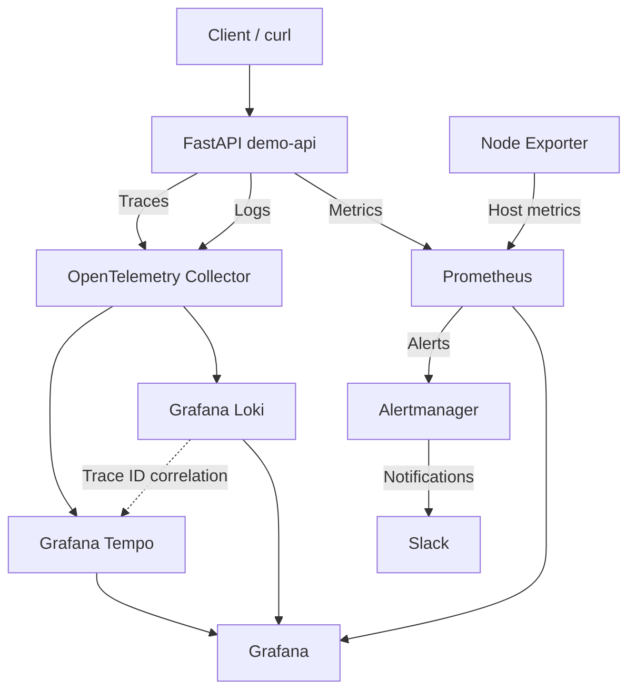
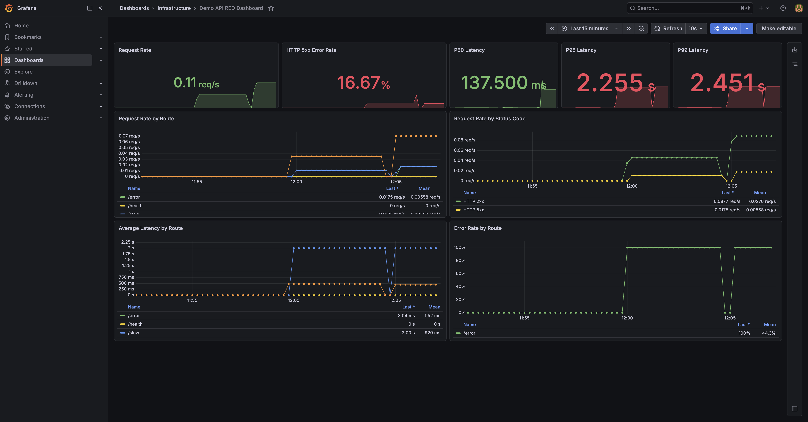
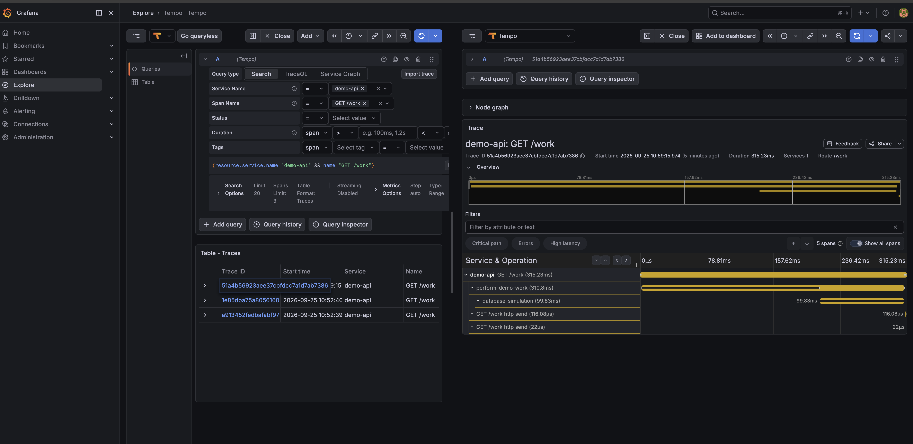
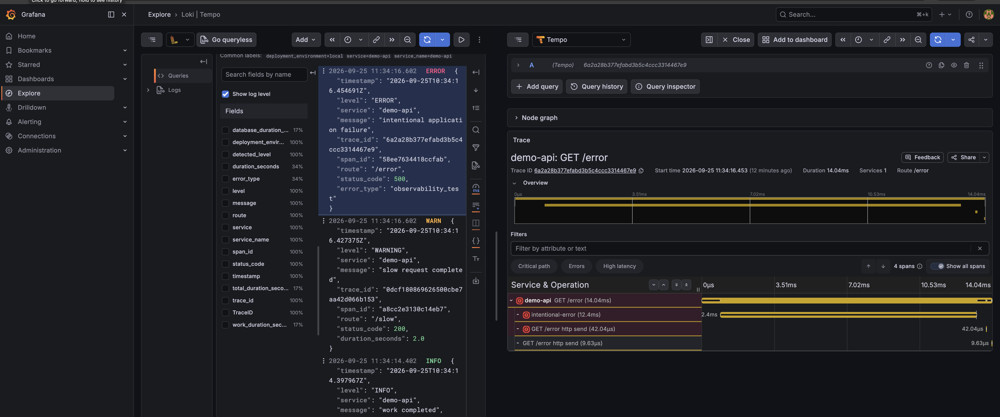
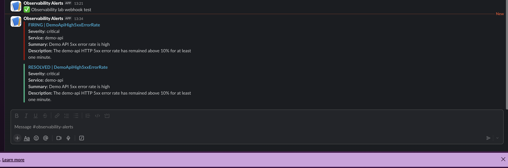
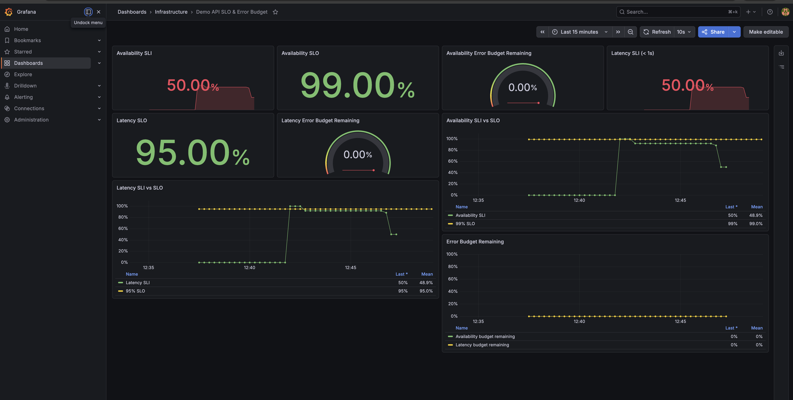

# Platform Engineering Observability

[](https://github.com/AZ1600/platform-engineering-observability/actions/workflows/validate-observability.yml)

A reproducible observability engineering lab built with **Prometheus, Grafana, OpenTelemetry, Loki, Tempo, Alertmanager, FastAPI, Docker, and Docker Compose**.

The project demonstrates the complete operational path from application telemetry to dashboards, distributed tracing, centralized logging, alerting, SLO monitoring, CI validation, and external Slack notifications.

```text
Application
    ↓
Metrics + Logs + Traces
    ↓
Prometheus + OpenTelemetry
    ↓
Grafana + Loki + Tempo
    ↓
Alerts + SLOs + Error Budgets
    ↓
Alertmanager
    ↓
Slack
```

---

# What This Project Demonstrates

The lab currently includes:

- FastAPI application instrumentation
- Prometheus application metrics
- Node Exporter infrastructure metrics
- RED application monitoring
- P50, P95, and P99 latency
- route-level traffic analysis
- structured JSON logging
- Grafana Loki
- OpenTelemetry distributed tracing
- Grafana Tempo
- log-to-trace correlation
- infrastructure alerting
- application-level alerting
- Alertmanager routing
- Slack alert notifications
- availability and latency SLIs
- availability and latency SLOs
- error budget monitoring
- Grafana dashboard provisioning
- GitHub Actions configuration validation
- controlled latency and failure testing

---

# Architecture



---

# Observability Signals

The platform covers the three core telemetry signals:

```text
Metrics
Logs
Traces
```

and extends them with:

```text
Alerting
SLIs
SLOs
Error Budgets
External Notifications
```

---

# RED Application Monitoring

The main application dashboard follows the RED method:

```text
R = Rate
E = Errors
D = Duration
```

The dashboard includes:

- Request Rate
- HTTP 5xx Error Rate
- P50 Latency
- P95 Latency
- P99 Latency
- Request Rate by Route
- Request Rate by Status Code
- Average Latency by Route
- Error Rate by Route

The dashboard is provisioned from:

```text
grafana/dashboards/demo-api-red.json
```



The test application contains intentional `/slow` and `/error` endpoints, allowing the dashboard to demonstrate real changes in latency and failure rate.

---

# Application Metrics

Prometheus scrapes the FastAPI application from:

```text
/metrics
```

Application monitoring uses metrics including:

```text
http_requests_total
http_request_duration_seconds
http_request_duration_highr_seconds
```

The `/metrics` endpoint is excluded from application traffic calculations so Prometheus scrape traffic does not distort RED measurements.

---

# Distributed Tracing

FastAPI is instrumented with OpenTelemetry.

The trace pipeline is:

```text
FastAPI
   ↓
OpenTelemetry SDK
   ↓
OpenTelemetry Collector
   ↓
Grafana Tempo
   ↓
Grafana
```

The `/work` endpoint produces nested spans:

```text
GET /work
└── perform-demo-work
    └── database-simulation
```



This provides visibility beyond HTTP duration and shows where time was spent inside the application.

---

# Structured Logging

The application writes structured JSON logs containing fields such as:

```text
timestamp
level
service
message
route
status_code
trace_id
span_id
duration_seconds
error_type
```

Example:

```json
{
  "level": "ERROR",
  "service": "demo-api",
  "message": "intentional application failure",
  "trace_id": "6a2a28b377efabd3b5c4ccc3314467e9",
  "span_id": "58ee7634418ccfab",
  "route": "/error",
  "status_code": 500,
  "error_type": "observability_test"
}
```

The log pipeline is:

```text
FastAPI
   ↓
Structured JSON
   ↓
OpenTelemetry Collector
   ↓
Grafana Loki
   ↓
Grafana
```

---

# Log-to-Trace Correlation

Application logs contain the active OpenTelemetry:

```text
trace_id
span_id
```

Grafana uses the trace ID as a derived field.

This creates the investigation path:

```text
Loki log
   ↓
TraceID
   ↓
View Trace
   ↓
Tempo
   ↓
Matching distributed trace
```



This allows an operator to move directly from an error log to the trace for the same request.

---

# Application Alerting

Prometheus evaluates application-level alert rules from:

```text
prometheus/rules/application.yml
```

Current application alerts include:

```text
DemoApiHigh5xxErrorRate
DemoApiHighP95Latency
```

## High 5xx Error Rate

Condition:

```text
HTTP 5xx error rate > 10%
for at least 1 minute
```

## High P95 Latency

Condition:

```text
P95 latency > 1 second
for at least 1 minute
```

The alert lifecycle is:

```text
Application behaviour
        ↓
Prometheus metrics
        ↓
Alert rule
        ↓
PENDING
        ↓
FIRING
        ↓
Alertmanager
```

---

# Slack Alert Notifications

Alertmanager now routes warning and critical alerts to Slack.

```text
Prometheus
     ↓
Alertmanager
     ↓
Severity routing
     ↓
Slack
```

The Slack integration was validated with a real application failure.

The notification showed both:

```text
FIRING
RESOLVED
```

states.



This confirms the complete operational lifecycle:

```text
/error traffic
      ↓
5xx rate increases
      ↓
Prometheus alert fires
      ↓
Alertmanager
      ↓
Slack FIRING notification
      ↓
Application recovers
      ↓
Slack RESOLVED notification
```

---

# Slack Secret Management

The Slack webhook is **not committed to Git**.

Locally it is stored in:

```text
.secrets/slack_webhook_url
```

The directory is excluded by:

```gitignore
.secrets/
```

Docker Compose mounts the file into Alertmanager as:

```text
/run/secrets/slack_webhook_url
```

Alertmanager references the webhook using:

```yaml
api_url_file: /run/secrets/slack_webhook_url
```

This keeps the real webhook outside version-controlled configuration.

GitHub Actions creates a harmless placeholder secret file only for configuration validation.

---

# SLIs and SLOs

The project defines two reliability objectives.

## Availability

```text
Availability SLO = 99%
```

The availability SLI measures:

```text
Successful non-5xx requests
          /
All application requests
```

Recording rule:

```text
demo_api:sli_availability_ratio:5m
```

---

## Latency

```text
Latency SLO = 95%
```

The latency SLI measures:

```text
Requests completed within 1 second
                /
Total application requests
```

Recording rule:

```text
demo_api:sli_latency_under_1s_ratio:5m
```

---

# Error Budgets

The SLOs define how much failure is acceptable.

For availability:

```text
99% SLO
→ 1% failure budget
```

For latency:

```text
95% SLO
→ 5% slow-request budget
```

Prometheus records:

```text
demo_api:error_budget_availability_remaining:5m
demo_api:error_budget_latency_remaining:5m
```

Values are constrained between:

```text
0% and 100%
```

---

# No-Traffic Handling

No application traffic is not treated as a service failure.

The SLI rules only emit values when application traffic exists.

```text
No requests
    ↓
No new SLI sample
```

This prevents an idle application from incorrectly appearing as:

```text
0% available
```

---

# SLO and Error Budget Dashboard

Grafana provisions:

```text
Demo API SLO & Error Budget
```

from:

```text
grafana/dashboards/demo-api-slo.json
```

The dashboard shows:

- Availability SLI
- Availability SLO
- Availability Error Budget Remaining
- Latency SLI
- Latency SLO
- Latency Error Budget Remaining
- Availability SLI vs SLO
- Latency SLI vs SLO
- Error Budget Remaining



A deliberate failure test produced:

```text
Availability SLI = 50%
Availability SLO = 99%

Latency SLI      = 50%
Latency SLO      = 95%

Error budgets    = 0%
```

The short five-minute measurement windows are intentional for local lab validation.

Production SLO implementations would normally use significantly longer rolling windows.

---

# Infrastructure Monitoring

Node Exporter provides host-level metrics including:

- CPU
- memory
- filesystems
- operating system statistics

Prometheus also monitors target health.

The existing infrastructure alert:

```text
TargetDown
```

fires when a monitored target remains unavailable for one minute.

---

# Demo Application

The FastAPI application exists specifically to generate predictable telemetry.

| Endpoint | Purpose |
|---|---|
| `GET /` | Basic application response |
| `GET /health` | Health check |
| `GET /work` | Normal request with nested spans |
| `GET /slow` | Intentional high-latency request |
| `GET /error` | Intentional HTTP 500 failure |
| `GET /metrics` | Prometheus metrics |

---

# Failure Testing

The lab deliberately generates abnormal behaviour.

## Application Failure

```text
GET /error
      ↓
HTTP 500
      ↓
Prometheus metrics
      ↓
RED dashboard
      ↓
ERROR log
      ↓
Loki
      ↓
Tempo trace
      ↓
Availability SLI impact
      ↓
Prometheus alert
      ↓
Alertmanager
      ↓
Slack
```

## Application Latency

```text
GET /slow
      ↓
~2 second response
      ↓
Latency histogram
      ↓
P95 / P99 increase
      ↓
WARNING log
      ↓
Tempo trace
      ↓
Latency SLI impact
      ↓
Latency alert
```

---

# GitHub Actions Validation

The repository contains:

```text
.github/workflows/validate-observability.yml
```

The workflow runs on pull requests and pushes to `main`.

It automatically validates:

```text
Docker Compose configuration
FastAPI Docker image build
Python application syntax
Prometheus configuration
Prometheus alert rules
Prometheus SLI/SLO recording rules
Alertmanager configuration
Grafana dashboard JSON
```

The CI pipeline is:

```text
Pull Request
     ↓
Checkout
     ↓
Create CI secret fixtures
     ↓
Docker Compose validation
     ↓
Application image build
     ↓
Python validation
     ↓
Prometheus validation
     ↓
Alertmanager validation
     ↓
Grafana JSON validation
```

This moves configuration validation out of a purely manual workflow and into version-controlled CI.

---

# Repository Structure

```text
.
├── .github/
│   └── workflows/
│       └── validate-observability.yml
│
├── .gitignore
│
├── alertmanager/
│   └── alertmanager.yml
│
├── app/
│   ├── Dockerfile
│   ├── main.py
│   └── requirements.txt
│
├── docs/
│   └── screenshots/
│
├── grafana/
│   ├── dashboards/
│   │   ├── demo-api-red.json
│   │   ├── demo-api-slo.json
│   │   └── node-exporter.json
│   │
│   └── provisioning/
│       ├── dashboards/
│       └── datasources/
│           ├── loki.yml
│           ├── prometheus.yml
│           └── tempo.yml
│
├── loki/
│   └── loki.yml
│
├── otel/
│   └── collector.yml
│
├── prometheus/
│   ├── prometheus.yml
│   └── rules/
│       ├── application.yml
│       ├── slo.yml
│       └── targets.yml
│
├── tempo/
│   └── tempo.yml
│
├── docker-compose.yml
└── README.md
```

---

# Running the Platform

## Prerequisites

Install:

```text
Docker Desktop
Docker Compose
Git
```

Verify:

```bash
docker --version
docker compose version
```

Clone:

```bash
git clone https://github.com/AZ1600/platform-engineering-observability.git

cd platform-engineering-observability
```

Start:

```bash
docker compose up -d --build
```

Check:

```bash
docker compose ps
```

Expected services:

```text
alertmanager
demo-api
grafana
loki
node-exporter
otel-collector
prometheus
tempo
```

---

# Local Service URLs

| Service | URL |
|---|---|
| Demo API | `http://127.0.0.1:8000` |
| Demo health | `http://127.0.0.1:8000/health` |
| Demo metrics | `http://127.0.0.1:8000/metrics` |
| Grafana | `http://127.0.0.1:3000` |
| Prometheus | `http://127.0.0.1:9090` |
| Prometheus rules | `http://127.0.0.1:9090/rules` |
| Prometheus alerts | `http://127.0.0.1:9090/alerts` |
| Alertmanager | `http://127.0.0.1:9093` |
| Loki | `http://127.0.0.1:3100` |
| Tempo | `http://127.0.0.1:3200` |

---

# Generate Telemetry

Normal requests:

```bash
for i in {1..20}; do
  curl -s http://127.0.0.1:8000/work > /dev/null
done
```

Slow requests:

```bash
for i in {1..5}; do
  curl -s http://127.0.0.1:8000/slow > /dev/null
done
```

Failed requests:

```bash
for i in {1..5}; do
  curl -s http://127.0.0.1:8000/error > /dev/null
done
```

---

# Configuration Validation

Docker Compose:

```bash
docker compose config
```

Prometheus:

```bash
docker compose run --rm --no-deps \
  --entrypoint /bin/promtool \
  prometheus \
  check config /etc/prometheus/prometheus.yml
```

Alertmanager:

```bash
docker compose run --rm --no-deps \
  --entrypoint /bin/amtool \
  alertmanager \
  check-config /etc/alertmanager/alertmanager.yml
```

Grafana dashboards:

```bash
for dashboard in grafana/dashboards/*.json; do
  python3 -m json.tool "$dashboard" > /dev/null
done
```

---

# Current Coverage

```text
Infrastructure metrics           ✓
Application metrics              ✓
RED monitoring                   ✓
P50/P95/P99 latency              ✓
Route-level monitoring           ✓

Distributed tracing              ✓
Custom spans                     ✓
Failure tracing                  ✓
Latency tracing                  ✓

Structured logging               ✓
Centralized logging              ✓
Log parsing                      ✓
Log-to-trace correlation         ✓

Infrastructure alerting          ✓
Application alerting             ✓
Alertmanager routing             ✓
Slack notifications              ✓
FIRING notifications             ✓
RESOLVED notifications           ✓

Availability SLI                 ✓
Latency SLI                      ✓
Availability SLO                 ✓
Latency SLO                      ✓
Error budget calculation         ✓
No-traffic handling              ✓
SLO dashboard                    ✓

Grafana provisioning             ✓
GitHub Actions validation        ✓
Failure/recovery testing         ✓
```

---

# Current Limitations

This is intentionally a local observability engineering lab.

Current limitations include:

- single demo application
- five-minute SLI/SLO lab windows
- local Loki storage
- local Tempo storage
- no high availability
- no production object storage
- no multi-window burn-rate alerting yet
- no production retention strategy
- no Kubernetes deployment
- local monitoring interfaces do not use authentication

---

# Next Phase

The next reliability improvement is **SLO burn-rate alerting**.

Instead of alerting only when a threshold is crossed, burn-rate monitoring asks:

```text
How quickly are we consuming the error budget?
```

The planned progression is:

```text
SLI
 ↓
SLO
 ↓
Error Budget
 ↓
Burn Rate
 ↓
Fast-burn Alert
 ↓
Slow-burn Alert
```

After that, the platform can be extended toward Kubernetes deployment and longer production-style SLO windows.

---

# Roadmap

```text
[Complete] Prometheus
[Complete] Node Exporter
[Complete] Grafana provisioning
[Complete] Infrastructure dashboard

[Complete] FastAPI application metrics
[Complete] RED application dashboard
[Complete] Route-level monitoring
[Complete] P50/P95/P99 latency

[Complete] OpenTelemetry tracing
[Complete] OpenTelemetry Collector
[Complete] Grafana Tempo
[Complete] Custom spans

[Complete] Structured JSON logging
[Complete] Grafana Loki
[Complete] Log-to-trace correlation

[Complete] Infrastructure alerts
[Complete] Application alerts
[Complete] Alertmanager
[Complete] Slack notifications
[Complete] FIRING and RESOLVED notifications

[Complete] Availability SLI
[Complete] Latency SLI
[Complete] Availability SLO
[Complete] Latency SLO
[Complete] Error budget monitoring
[Complete] SLO dashboard

[Complete] GitHub Actions validation

[Next] SLO burn-rate alerting

[Future] Longer production-style SLO windows
[Future] Kubernetes deployment
[Future] Highly available telemetry storage
```

---

# Technology Stack

**Application**

```text
Python
FastAPI
Uvicorn
```

**Telemetry**

```text
OpenTelemetry
OpenTelemetry Collector
```

**Metrics**

```text
Prometheus
Node Exporter
```

**Logs**

```text
Grafana Loki
```

**Traces**

```text
Grafana Tempo
```

**Visualization**

```text
Grafana
```

**Alerting**

```text
Prometheus Rules
Alertmanager
Slack
```

**Reliability**

```text
RED
SLIs
SLOs
Error Budgets
```

**CI**

```text
GitHub Actions
```

**Platform**

```text
Docker
Docker Compose
```

---

# Author

**Olawale Azeez**

Cloud Engineer | Platform Engineer | DevOps Engineer

Focused on Platform Engineering, Kubernetes, Cloud Infrastructure, Observability, Internal Developer Platforms, and Developer Experience.

Portfolio: [Olawale Azeez Portfolio](https://az1600.github.io)

GitHub: [AZ1600](https://github.com/AZ1600)