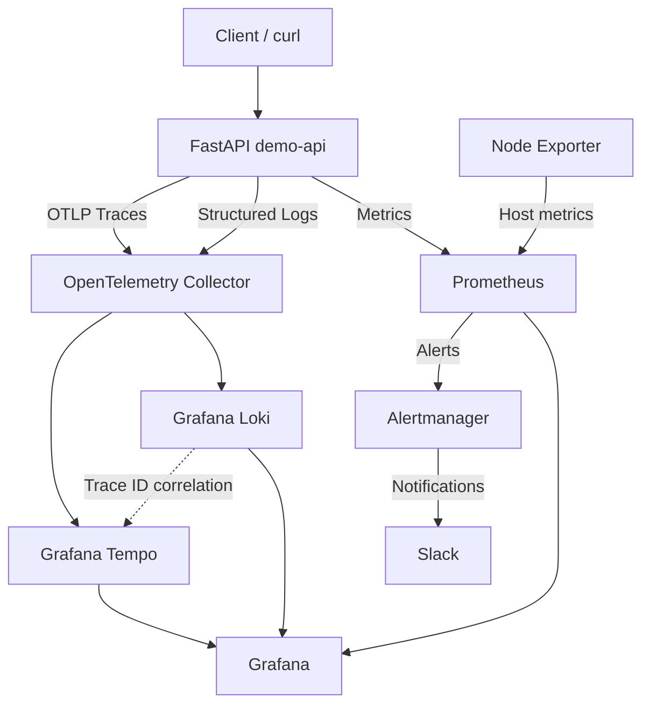
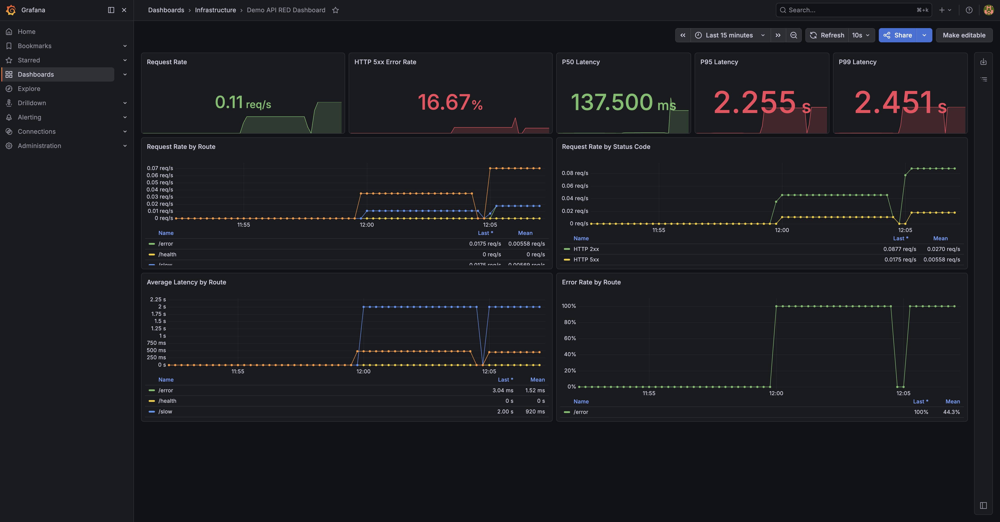
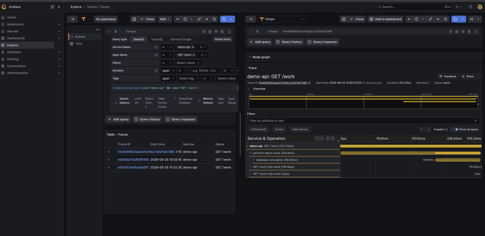
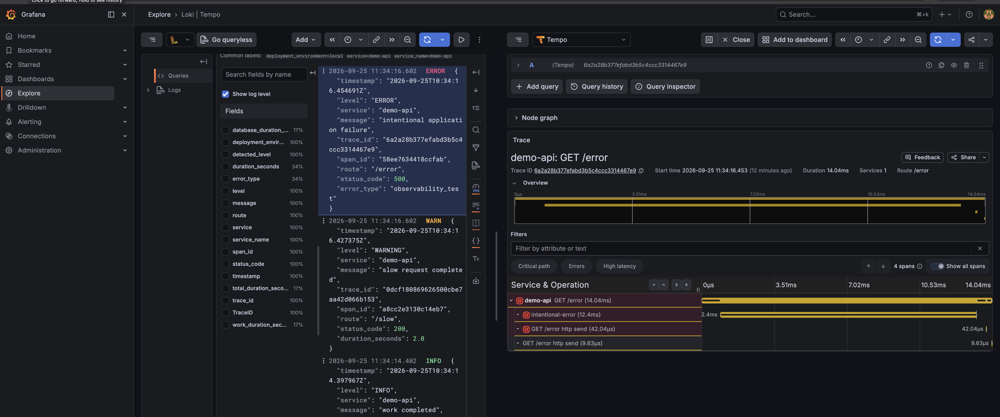
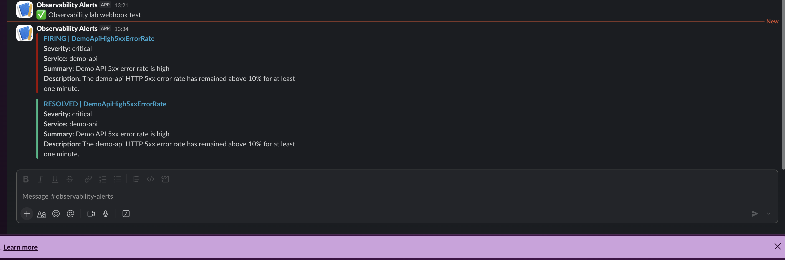
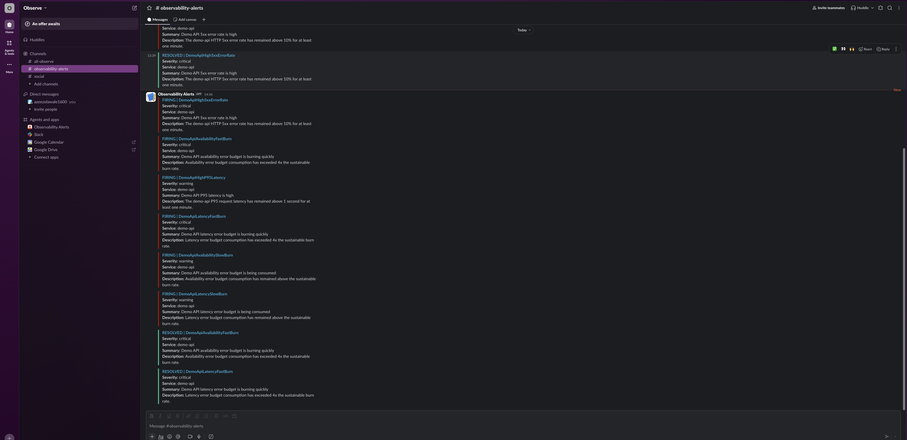
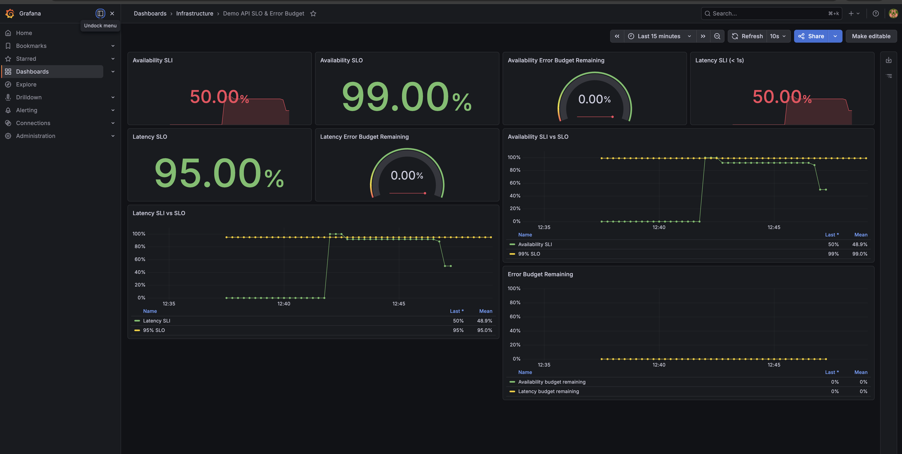

# Platform Engineering Observability

[](https://github.com/AZ1600/platform-engineering-observability/actions/workflows/validate-observability.yml)

A reproducible observability engineering lab built with **Prometheus, Grafana, OpenTelemetry, Loki, Tempo, Alertmanager, FastAPI, Docker, and Docker Compose**.

The project demonstrates the complete operational path from application telemetry to dashboards, distributed tracing, centralized logging, alerting, SLO monitoring, error-budget burn-rate detection, automated Prometheus rule testing, end-to-end telemetry validation, and external Slack notifications.

```text
Application
    │
    ├── Metrics
    ├── Logs
    └── Traces
         │
         ▼
Prometheus + OpenTelemetry Collector
         │
         ├── Prometheus
         ├── Loki
         └── Tempo
         │
         ▼
Grafana
         │
         ├── RED dashboards
         ├── SLO dashboards
         ├── Logs
         └── Traces
         │
         ▼
Prometheus Rules
         │
         ├── Application alerts
         ├── SLOs
         ├── Error budgets
         └── Burn-rate alerts
         │
         ▼
Alertmanager
         │
         ▼
Slack
```

---

# What This Project Demonstrates

The lab includes:

- FastAPI application instrumentation
- Prometheus application metrics
- Node Exporter infrastructure metrics
- RED application monitoring
- P50, P95, and P99 latency
- route-level traffic analysis
- structured JSON logging
- Grafana Loki centralized logging
- OpenTelemetry distributed tracing
- Grafana Tempo
- custom nested spans
- log-to-trace correlation
- infrastructure alerting
- application-level alerting
- Alertmanager routing
- Slack alert notifications
- availability and latency SLIs
- availability and latency SLOs
- error-budget monitoring
- multi-window burn-rate monitoring
- fast-burn and slow-burn alerting
- Grafana dashboard provisioning
- Prometheus rule unit testing with `promtool`
- automated SLI and alert behavior validation
- GitHub Actions configuration validation
- end-to-end observability smoke testing
- automated Prometheus metric verification
- automated Loki log verification
- automated Tempo trace verification
- hardened non-root application container
- read-only application root filesystem
- dropped Linux capabilities
- `no-new-privileges`
- health-based service startup
- fully pinned Python dependency lock
- immutable SHA256-pinned observability images
- controlled latency and failure testing

---

# Architecture


```mermaid
flowchart TB
    Client["Client / curl"]
    API["FastAPI demo-api"]

    Prometheus["Prometheus"]
    Node["Node Exporter"]

    OTel["OpenTelemetry Collector"]
    Loki["Grafana Loki"]
    Tempo["Grafana Tempo"]

    Grafana["Grafana"]
    Alertmanager["Alertmanager"]
    Slack["Slack"]

    Client --> API

    API -->|Metrics| Prometheus
    Node -->|Host metrics| Prometheus

    API -->|Structured Logs| OTel
    API -->|OTLP Traces| OTel

    OTel --> Loki
    OTel --> Tempo

    Prometheus --> Grafana
    Loki --> Grafana
    Tempo --> Grafana

    Prometheus -->|Alerts| Alertmanager
    Alertmanager -->|Notifications| Slack

    Loki -. Trace ID correlation .-> Tempo
```

---

# Observability Signals

The platform covers the three core telemetry signals:

```text
Metrics
Logs
Traces
```

and extends them with reliability engineering controls:

```text
Alerting
SLIs
SLOs
Error Budgets
Burn Rates
External Notifications
Rule Testing
End-to-End Telemetry Validation
```

---

# RED Application Monitoring

The application dashboard follows the RED method:

```text
R = Rate
E = Errors
D = Duration
```

The dashboard includes:

- request rate
- HTTP 5xx error rate
- P50 latency
- P95 latency
- P99 latency
- request rate by route
- request rate by status code
- average latency by route
- error rate by route

The dashboard is provisioned from:

```text
grafana/dashboards/demo-api-red.json
```



The demo application contains intentional `/slow` and `/error` endpoints so changes in latency and failure rate can be generated deliberately and observed across the platform.

---

# Application Metrics

Prometheus scrapes the FastAPI application from:

```text
/metrics
```

Application monitoring uses metrics including:

```text
http_requests_total
http_request_duration_seconds
http_request_duration_highr_seconds
```

The `/metrics` endpoint is excluded from normal application traffic calculations so Prometheus scrape traffic does not distort RED measurements.

Prometheus also monitors:

```text
up
```

for target availability.

---

# Distributed Tracing

FastAPI is instrumented with OpenTelemetry.

```text
FastAPI
   │
   ▼
OpenTelemetry SDK
   │
   ▼
OpenTelemetry Collector
   │
   ▼
Grafana Tempo
   │
   ▼
Grafana
```

The `/work` endpoint produces nested spans:

```text
GET /work
└── perform-demo-work
    └── database-simulation
```



This provides visibility beyond HTTP duration and shows where time is spent inside an application request.

---

# Structured Logging

The application writes structured JSON logs containing fields including:

```text
timestamp
level
service
message
route
status_code
trace_id
span_id
duration_seconds
error_type
```

Example:

```json
{
  "level": "ERROR",
  "service": "demo-api",
  "message": "intentional application failure",
  "trace_id": "6a2a28b377efabd3b5c4ccc3314467e9",
  "span_id": "58ee7634418ccfab",
  "route": "/error",
  "status_code": 500,
  "error_type": "observability_test"
}
```

The log pipeline is:

```text
FastAPI
   │
   ▼
Structured JSON
   │
   ▼
OpenTelemetry Collector
   │
   ▼
Grafana Loki
   │
   ▼
Grafana
```

---

# Log-to-Trace Correlation

Application logs contain the active OpenTelemetry:

```text
trace_id
span_id
```

Grafana Loki uses the trace ID as a derived field.

```text
Loki log
   │
   ▼
Trace ID
   │
   ▼
View Trace
   │
   ▼
Tempo
   │
   ▼
Matching distributed trace
```



This creates a direct operational investigation path from an error log to the distributed trace for the same request.

---

# Application Alerting

Prometheus evaluates application-level alerts from:

```text
prometheus/rules/application.yml
```

Current application alerts include:

```text
DemoApiHigh5xxErrorRate
DemoApiHighP95Latency
```

## High 5xx Error Rate

Condition:

```text
HTTP 5xx error rate > 10%
for at least 1 minute
```

## High P95 Latency

Condition:

```text
P95 latency > 1 second
for at least 1 minute
```

Alert lifecycle:

```text
Application behaviour
        │
        ▼
Prometheus metrics
        │
        ▼
Alert rule
        │
        ▼
PENDING
        │
        ▼
FIRING
        │
        ▼
Alertmanager
```

---

# Infrastructure Alerting

Node Exporter provides host-level metrics including:

- CPU
- memory
- filesystems
- operating system statistics

Prometheus also evaluates target health.

The infrastructure alert:

```text
TargetDown
```

fires when a monitored target remains unavailable for at least one minute.

---

# Slack Alert Notifications

Alertmanager routes warning and critical alerts to Slack.

```text
Prometheus
     │
     ▼
Alertmanager
     │
     ▼
Severity Routing
     │
     ▼
Slack
```

The Slack integration was validated with real application failure scenarios.

Notifications demonstrated both:

```text
FIRING
RESOLVED
```

states.



---

# Slack Secret Management

The Slack webhook is **not committed to Git**.

Locally it is stored in:

```text
.secrets/slack_webhook_url
```

The directory is ignored by Git:

```gitignore
.secrets/
```

Docker Compose mounts the secret into Alertmanager as:

```text
/run/secrets/slack_webhook_url
```

Alertmanager references it with:

```yaml
api_url_file: /run/secrets/slack_webhook_url
```

GitHub Actions creates a harmless placeholder webhook file solely for configuration and integration testing.

---

# SLIs and SLOs

The project defines two service-level objectives.

## Availability SLO

```text
Availability SLO = 99%
```

The availability SLI measures:

```text
Successful non-5xx requests
          /
All application requests
```

Recording rule:

```text
demo_api:sli_availability_ratio:5m
```

---

## Latency SLO

```text
Latency SLO = 95%
```

The latency SLI measures:

```text
Requests completed within 1 second
                /
Total application requests
```

Recording rule:

```text
demo_api:sli_latency_under_1s_ratio:5m
```

---

# Error Budgets

The SLOs define the amount of failure that is acceptable.

Availability:

```text
99% SLO
→ 1% failure budget
```

Latency:

```text
95% SLO
→ 5% slow-request budget
```

Prometheus records:

```text
demo_api:error_budget_availability_remaining:5m
demo_api:error_budget_latency_remaining:5m
```

Values are constrained between:

```text
0% and 100%
```

---

# No-Traffic Handling

No application traffic is not treated as a service failure.

The SLI rules emit values only when application traffic exists.

```text
No requests
    │
    ▼
No new SLI sample
```

This prevents an idle application from appearing as:

```text
0% available
```

---

# SLO Burn-Rate Alerting

The platform monitors how quickly the service consumes its error budget.

```text
Burn Rate
=
Observed bad-event rate
/
Allowed bad-event rate
```

A burn rate of:

```text
1x
```

means the service is consuming its error budget at exactly the sustainable rate.

---

## Availability Burn Rate

Availability target:

```text
99%
```

Allowed failure:

```text
1%
```

Example:

```text
50% failed requests
÷
1% allowed failures
=
50x burn rate
```

---

## Latency Burn Rate

Latency objective:

```text
95% within 1 second
```

Allowed slow requests:

```text
5%
```

Example:

```text
50% slow requests
÷
5% allowed
=
10x burn rate
```

---

# Multi-Window Burn-Rate Detection

Prometheus records burn rate over:

```text
1 minute
5 minutes
15 minutes
```

Rules are stored in:

```text
prometheus/rules/burn-rate.yml
```

## Fast Burn

Fast-burn alerts require both short windows to exceed:

```text
4x
```

the sustainable error-budget consumption rate.

```text
1m burn rate > 4
AND
5m burn rate > 4
```

Severity:

```text
critical
```

Alerts:

```text
DemoApiAvailabilityFastBurn
DemoApiLatencyFastBurn
```

## Slow Burn

Slow-burn alerts detect lower but sustained budget consumption.

```text
5m burn rate > 1
AND
15m burn rate > 1
```

Severity:

```text
warning
```

Alerts:

```text
DemoApiAvailabilitySlowBurn
DemoApiLatencySlowBurn
```

---

# Burn-Rate Notification Evidence

Burn-rate alerts use the existing Prometheus → Alertmanager → Slack pipeline.

```text
Application degradation
        │
        ▼
SLI falls below objective
        │
        ▼
Error-budget consumption
        │
        ▼
Burn-rate calculation
        │
        ▼
Fast / Slow burn alert
        │
        ▼
Alertmanager
        │
        ▼
Slack
```

Validation produced both fast-burn and slow-burn alerts.



---

# SLO and Error Budget Dashboard

Grafana provisions:

```text
Demo API SLO & Error Budget
```

from:

```text
grafana/dashboards/demo-api-slo.json
```

The dashboard includes:

- Availability SLI
- Availability SLO
- Availability Error Budget Remaining
- Latency SLI
- Latency SLO
- Latency Error Budget Remaining
- Availability SLI vs SLO
- Latency SLI vs SLO
- Error Budget Remaining



The short measurement windows are intentional for local lab validation.

Production SLO implementations would normally use significantly longer rolling windows.

---

# Prometheus Rule Unit Testing

Prometheus configuration validation alone proves that rules are syntactically valid.

This project goes further by testing rule behaviour with:

```text
promtool test rules
```

Tests are stored in:

```text
prometheus/tests/rules.test.yml
```

The unit tests currently verify representative reliability behavior including:

- `TargetDown`
- high HTTP 5xx error-rate alerting
- availability SLI calculation
- availability fast-burn alerting
- availability slow-burn alerting

The tests use synthetic time-series data so alert behavior can be validated deterministically without waiting for real incidents.

Example validation path:

```text
Synthetic Prometheus series
        │
        ▼
Recording Rules
        │
        ▼
SLI Calculation
        │
        ▼
Burn-Rate Calculation
        │
        ▼
Alert Evaluation
        │
        ▼
Expected Labels + Annotations
```

This verifies not only Prometheus syntax, but operational logic.

---

# End-to-End Observability Smoke Testing

GitHub Actions also starts the complete observability stack and verifies that telemetry reaches its intended destination.

The smoke test is implemented in:

```text
scripts/observability-smoke.sh
```

The test:

1. starts the complete Docker Compose stack
2. waits for platform readiness
3. generates real application traffic
4. verifies Prometheus is scraping the application
5. verifies application metrics are queryable
6. verifies application logs arrive in Loki
7. verifies application traces arrive in Tempo
8. captures service status and logs on CI failure
9. destroys the test stack and volumes after completion

Validated path:

```text
FastAPI
   ├── Metrics ───────────────→ Prometheus
   │
   ├── Structured Logs
   │         │
   │         ▼
   │   OpenTelemetry Collector
   │         │
   │         └───────────────→ Loki
   │
   └── Traces
             │
             ▼
      OpenTelemetry Collector
             │
             └───────────────→ Tempo
```

Successful smoke-test output includes:

```text
Demo API: ready
Prometheus: ready
Loki: ready
Tempo: ready
Grafana: ready
Alertmanager: ready

Application telemetry generated.

Prometheus demo-api target: verified
Prometheus application metrics: verified
Loki application logs: verified
Tempo application traces: verified

End-to-end observability smoke test passed.
```

---

# Hardened Application Runtime

The demo API runs using a hardened container configuration.

## Docker Image

The application image:

- uses Python 3.12 slim
- runs as non-root UID/GID `10001`
- uses an explicit application user and group
- uses pinned Python dependencies
- includes an application health check
- avoids running as root

Runtime identity:

```text
uid=10001(appuser)
gid=10001(appgroup)
```

## Docker Compose Runtime

The API additionally uses:

```text
read-only root filesystem
all Linux capabilities dropped
no-new-privileges
restricted tmpfs at /tmp
init process handling
graceful shutdown period
```

Writes to the root filesystem are rejected while `/tmp` remains available as an ephemeral writable path.

---

# Health-Based Startup

The API container includes a real `/health` probe.

Prometheus uses:

```yaml
depends_on:
  demo-api:
    condition: service_healthy
```

This ensures Prometheus does not begin normal startup until the application has reached a healthy state.

---

# Dependency Reproducibility

Direct application dependencies are maintained in:

```text
app/requirements.in
```

A fully pinned dependency lock is generated as:

```text
app/requirements.txt
```

This locks both direct and transitive Python dependencies.

Example workflow:

```bash
pip-compile \
  --resolver=backtracking \
  --output-file=requirements.txt \
  requirements.in
```

The runtime image installs from the pinned lock file rather than unconstrained package names.

---

# Immutable Observability Images

External observability platform images are pinned to immutable SHA256 digests in `docker-compose.yml`.

Examples include:

```text
Prometheus
Grafana
Node Exporter
Alertmanager
Tempo
Loki
OpenTelemetry Collector
```

Instead of:

```text
image: vendor/image:latest
```

the stack uses:

```text
image: vendor/image@sha256:...
```

This prevents unexpected upstream image changes from silently altering the lab.

---

# Demo Application

The FastAPI application exists specifically to generate predictable telemetry.

| Endpoint | Purpose |
|---|---|
| `GET /` | Basic application response |
| `GET /health` | Application health check |
| `GET /work` | Normal request with nested spans |
| `GET /slow` | Intentional high-latency request |
| `GET /error` | Intentional HTTP 500 failure |
| `GET /metrics` | Prometheus metrics |

---

# Failure Testing

The lab deliberately generates abnormal behavior.

## Application Failure

```text
GET /error
      │
      ▼
HTTP 500
      │
      ▼
Prometheus metrics
      │
      ├── RED dashboard
      ├── Availability SLI
      └── Alert rules
      │
      ▼
ERROR log
      │
      ▼
Loki
      │
      ▼
Tempo trace
      │
      ▼
Alertmanager
      │
      ▼
Slack
```

## Application Latency

```text
GET /slow
      │
      ▼
~2 second response
      │
      ▼
Latency histogram
      │
      ├── P95 / P99 increase
      ├── Latency SLI
      └── Latency alert
      │
      ▼
WARNING log
      │
      ▼
Tempo trace
```

---

# GitHub Actions Validation

The workflow is located at:

```text
.github/workflows/validate-observability.yml
```

It runs on:

```text
pull requests to main
pushes to main
```

The pipeline has two major phases.

## Configuration and Rule Validation

```text
Checkout
   │
   ▼
Create CI secret fixture
   │
   ▼
Docker Compose validation
   │
   ▼
Application image build
   │
   ▼
Python syntax validation
   │
   ▼
Prometheus config validation
   │
   ▼
Prometheus rule unit tests
   │
   ▼
Alertmanager config validation
   │
   ▼
Grafana dashboard JSON validation
```

## End-to-End Smoke Test

```text
Start full stack
      │
      ▼
Wait for readiness
      │
      ▼
Generate application traffic
      │
      ├── Prometheus metrics
      ├── Loki logs
      └── Tempo traces
      │
      ▼
Verify each telemetry backend
      │
      ▼
SUCCESS
```

Failure diagnostics include:

```text
docker compose ps
docker compose logs
```

and CI always performs stack cleanup afterwards.

---

# Repository Structure

```text
.
├── .github/
│   └── workflows/
│       └── validate-observability.yml
│
├── .gitignore
│
├── alertmanager/
│   └── alertmanager.yml
│
├── app/
│   ├── Dockerfile
│   ├── main.py
│   ├── requirements.in
│   └── requirements.txt
│
├── docs/
│   └── screenshots/
│       ├── alertmanager-application-alerts.png
│       ├── alertmanager-target-down.png
│       ├── grafana-demo-api-red-dashboard.png
│       ├── grafana-loki-structured-logs.png
│       ├── grafana-loki-trace-correlation.png
│       ├── grafana-slo-error-budget.png
│       ├── grafana-tempo-error-trace.png
│       ├── grafana-tempo-work-trace.png
│       ├── prometheus-alert-firing.png
│       ├── prometheus-application-alerts.png
│       ├── prometheus-application-rule-health.png
│       ├── prometheus-burn-rate-alerts.png
│       ├── prometheus-burn-rate-rule-health.png
│       ├── prometheus-sli-slo-rule-health.png
│       ├── prometheus-targets.png
│       ├── slack-application-alert-firing-resolved.png
│       └── slack-burn-rate-alerts.png
│
├── grafana/
│   ├── dashboards/
│   │   ├── demo-api-red.json
│   │   ├── demo-api-slo.json
│   │   └── node-exporter.json
│   │
│   └── provisioning/
│       ├── dashboards/
│       └── datasources/
│           ├── loki.yml
│           ├── prometheus.yml
│           └── tempo.yml
│
├── loki/
│   └── loki.yml
│
├── otel/
│   └── collector.yml
│
├── prometheus/
│   ├── prometheus.yml
│   ├── rules/
│   │   ├── application.yml
│   │   ├── burn-rate.yml
│   │   ├── slo.yml
│   │   └── targets.yml
│   └── tests/
│       └── rules.test.yml
│
├── scripts/
│   └── observability-smoke.sh
│
├── tempo/
│   └── tempo.yml
│
├── docker-compose.yml
└── README.md
```

---

# Running the Platform

## Prerequisites

Install:

```text
Docker Desktop
Docker Compose
Git
```

Verify:

```bash
docker --version
docker compose version
```

Clone:

```bash
git clone https://github.com/AZ1600/platform-engineering-observability.git

cd platform-engineering-observability
```

---

# Slack Webhook Setup

Create the local secret directory:

```bash
mkdir -p .secrets
```

Store your webhook:

```bash
printf '%s' 'YOUR_SLACK_WEBHOOK_URL' \
  > .secrets/slack_webhook_url
```

The `.secrets/` directory is ignored by Git.

---

# Start the Stack

```bash
docker compose up -d --build
```

Check service state:

```bash
docker compose ps
```

Expected services:

```text
alertmanager
demo-api
grafana
loki
node-exporter
otel-collector
prometheus
tempo
```

The demo API should report:

```text
healthy
```

---

# Local Service URLs

| Service | URL |
|---|---|
| Demo API | `http://127.0.0.1:8000` |
| Demo health | `http://127.0.0.1:8000/health` |
| Demo metrics | `http://127.0.0.1:8000/metrics` |
| Grafana | `http://127.0.0.1:3000` |
| Prometheus | `http://127.0.0.1:9090` |
| Prometheus rules | `http://127.0.0.1:9090/rules` |
| Prometheus alerts | `http://127.0.0.1:9090/alerts` |
| Alertmanager | `http://127.0.0.1:9093` |
| Loki | `http://127.0.0.1:3100` |
| Tempo | `http://127.0.0.1:3200` |

---

# Generate Telemetry

Normal requests:

```bash
for i in {1..20}; do
  curl -s http://127.0.0.1:8000/work > /dev/null
done
```

Slow requests:

```bash
for i in {1..5}; do
  curl -s http://127.0.0.1:8000/slow > /dev/null
done
```

Failure requests:

```bash
for i in {1..5}; do
  curl -s http://127.0.0.1:8000/error > /dev/null
done
```

---

# Configuration Validation

Docker Compose:

```bash
docker compose config --quiet
```

Prometheus configuration:

```bash
docker compose run --rm --no-deps \
  --entrypoint /bin/promtool \
  prometheus \
  check config /etc/prometheus/prometheus.yml
```

Prometheus rule tests:

```bash
docker compose run --rm --no-deps \
  --entrypoint /bin/promtool \
  prometheus \
  test rules /etc/prometheus/tests/rules.test.yml
```

Alertmanager:

```bash
docker compose run --rm --no-deps \
  --entrypoint /bin/amtool \
  alertmanager \
  check-config /etc/alertmanager/alertmanager.yml
```

Grafana dashboards:

```bash
for dashboard in grafana/dashboards/*.json; do
  python3 -m json.tool "$dashboard" > /dev/null
done
```

---

# Run the End-to-End Smoke Test

Start from a clean environment:

```bash
docker compose down --volumes
docker compose up -d --build
```

Run:

```bash
./scripts/observability-smoke.sh
```

Expected final result:

```text
End-to-end observability smoke test passed.
```

---

# Security and Reproducibility

The lab applies several practical controls:

```text
Demo API non-root UID/GID
Read-only application root filesystem
Linux capabilities dropped
no-new-privileges
Restricted writable /tmp
Docker health check
Health-aware dependency startup
Pinned Python dependency graph
Immutable SHA256 platform images
Local secret management
Read-only mounted configuration
CI validation
Automated telemetry verification
```

These controls make the lab more deterministic and reduce the gap between a basic local demo and production-style platform engineering practices.

---

# Current Coverage

```text
Infrastructure metrics                   ✓
Application metrics                      ✓
RED monitoring                           ✓
P50/P95/P99 latency                      ✓
Route-level monitoring                   ✓

Distributed tracing                      ✓
Custom spans                             ✓
Failure tracing                          ✓
Latency tracing                          ✓

Structured logging                       ✓
Centralized logging                      ✓
Log parsing                              ✓
Log-to-trace correlation                 ✓

Infrastructure alerting                  ✓
Application alerting                     ✓
Alertmanager routing                     ✓
Slack notifications                      ✓
FIRING notifications                     ✓
RESOLVED notifications                   ✓

Availability SLI                         ✓
Latency SLI                              ✓
Availability SLO                         ✓
Latency SLO                              ✓
Error-budget calculation                 ✓
No-traffic handling                      ✓
SLO dashboard                            ✓

Burn-rate recording rules                ✓
Fast-burn alerting                       ✓
Slow-burn alerting                       ✓
Burn-rate Slack notifications            ✓

Prometheus rule unit testing             ✓
TargetDown rule test                     ✓
5xx alert rule test                      ✓
Availability SLI rule test               ✓
Availability fast-burn rule test         ✓
Availability slow-burn rule test         ✓

Hardened application runtime             ✓
Non-root application                     ✓
Read-only root filesystem                ✓
Dropped capabilities                     ✓
Pinned Python dependencies               ✓
Immutable platform images                ✓

Grafana provisioning                     ✓
GitHub Actions validation                ✓
End-to-end CI smoke testing              ✓
Prometheus metric verification           ✓
Loki log verification                    ✓
Tempo trace verification                 ✓
Failure/recovery testing                 ✓
```

---

# Current Limitations

This repository is intentionally a local observability engineering lab rather than a production monitoring platform.

Current limitations include:

- single demo application
- short lab-oriented SLI/SLO windows
- single-node Prometheus
- local Loki storage
- local Tempo storage
- no high availability
- no production object storage
- no production retention strategy
- no Kubernetes deployment
- local monitoring interfaces do not use authentication
- no remote-write architecture
- no long-term metrics backend
- no production secrets manager

---

# Future Extensions

Potential future extensions include:

```text
Longer production-style SLO windows
Kubernetes deployment
Prometheus remote write
Highly available telemetry storage
Production retention policies
Authentication for monitoring interfaces
Persistent object storage for Loki and Tempo
Long-term metrics storage
Secrets-manager integration
```

The core observability engineering scope is already complete.

---

# Completed Roadmap

```text
[Complete] Prometheus
[Complete] Node Exporter
[Complete] Grafana provisioning
[Complete] Infrastructure dashboard

[Complete] FastAPI application metrics
[Complete] RED application dashboard
[Complete] Route-level monitoring
[Complete] P50/P95/P99 latency

[Complete] OpenTelemetry tracing
[Complete] OpenTelemetry Collector
[Complete] Grafana Tempo
[Complete] Custom spans

[Complete] Structured JSON logging
[Complete] Grafana Loki
[Complete] Log-to-trace correlation

[Complete] Infrastructure alerts
[Complete] Application alerts
[Complete] Alertmanager
[Complete] Slack notifications
[Complete] FIRING and RESOLVED notifications

[Complete] Availability SLI
[Complete] Latency SLI
[Complete] Availability SLO
[Complete] Latency SLO
[Complete] Error-budget monitoring
[Complete] SLO dashboard

[Complete] Fast-burn alerting
[Complete] Slow-burn alerting
[Complete] Burn-rate Slack notifications

[Complete] Prometheus rule unit testing
[Complete] Target health rule testing
[Complete] Application alert rule testing
[Complete] Availability SLI rule testing
[Complete] Fast-burn rule testing
[Complete] Slow-burn rule testing

[Complete] Non-root demo API
[Complete] Read-only application filesystem
[Complete] Linux capability reduction
[Complete] no-new-privileges
[Complete] Container health checks
[Complete] Health-aware service dependencies
[Complete] Pinned Python dependencies
[Complete] Immutable platform image digests

[Complete] GitHub Actions configuration validation
[Complete] Full-stack CI startup
[Complete] End-to-end Prometheus verification
[Complete] End-to-end Loki verification
[Complete] End-to-end Tempo verification
[Complete] Automatic CI cleanup
```

---

# Technology Stack

## Application

```text
Python
FastAPI
Uvicorn
```

## Telemetry

```text
OpenTelemetry
OpenTelemetry Collector
```

## Metrics

```text
Prometheus
Node Exporter
```

## Logs

```text
Grafana Loki
```

## Traces

```text
Grafana Tempo
```

## Visualization

```text
Grafana
```

## Alerting

```text
Prometheus Rules
Alertmanager
Slack
```

## Reliability Engineering

```text
RED
SLIs
SLOs
Error Budgets
Multi-window Burn Rates
Prometheus Rule Tests
```

## CI

```text
GitHub Actions
promtool
End-to-End Smoke Testing
```

## Platform

```text
Docker
Docker Compose
Immutable Image Digests
```

---

# Engineering Skills Demonstrated

## Observability Engineering

- metrics architecture
- centralized logging
- distributed tracing
- OpenTelemetry instrumentation
- telemetry collection
- log-to-trace correlation
- dashboard provisioning
- alert routing

## Site Reliability Engineering

- RED monitoring
- SLIs
- SLOs
- error budgets
- multi-window burn-rate alerts
- service health monitoring
- failure simulation
- recovery validation

## Platform Engineering

- reproducible local platform environments
- Docker Compose orchestration
- health-aware service dependencies
- immutable image references
- configuration-as-code
- automated validation

## Security

- non-root container workloads
- read-only root filesystems
- Linux capability reduction
- `no-new-privileges`
- secret isolation
- pinned dependencies
- immutable container images

## CI/CD

- GitHub Actions
- configuration validation
- Prometheus unit testing
- integration testing
- end-to-end smoke testing
- failure diagnostics
- automated cleanup

---

# Purpose

This repository is an **observability and reliability engineering case study**.

It demonstrates how an application can be instrumented and operated through the complete telemetry lifecycle:

```text
Application
    │
    ├── Metrics
    ├── Logs
    └── Traces
    │
    ▼
Collection
    │
    ▼
Storage
    │
    ▼
Visualization
    │
    ▼
Reliability Analysis
    │
    ▼
Alerting
    │
    ▼
Incident Notification
    │
    ▼
Automated Validation
```

The project focuses on practical Platform Engineering, Site Reliability Engineering, DevOps, application observability, telemetry pipelines, SLO engineering, container hardening, and automated operational validation.

---

# Author

**Olawale Azeez**

Cloud Engineer | Platform Engineer | DevOps Engineer

Focused on Platform Engineering, Kubernetes, Cloud Infrastructure, Observability, Internal Developer Platforms, and Developer Experience.

Portfolio: [Olawale Azeez Portfolio](https://az1600.github.io)

GitHub: [AZ1600](https://github.com/AZ1600)